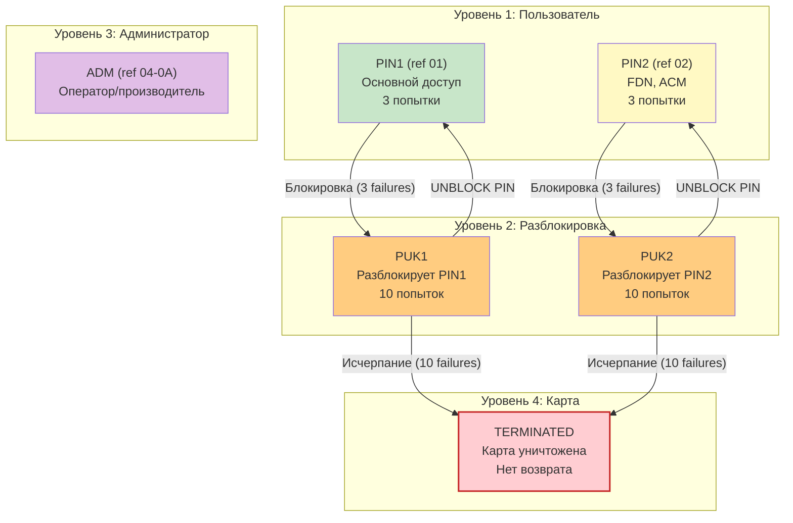
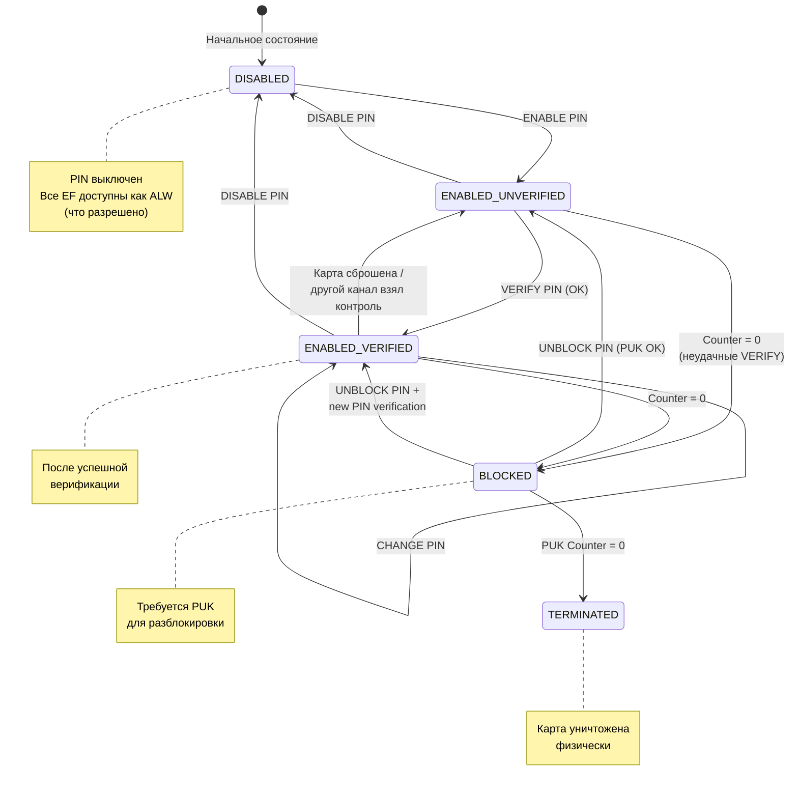
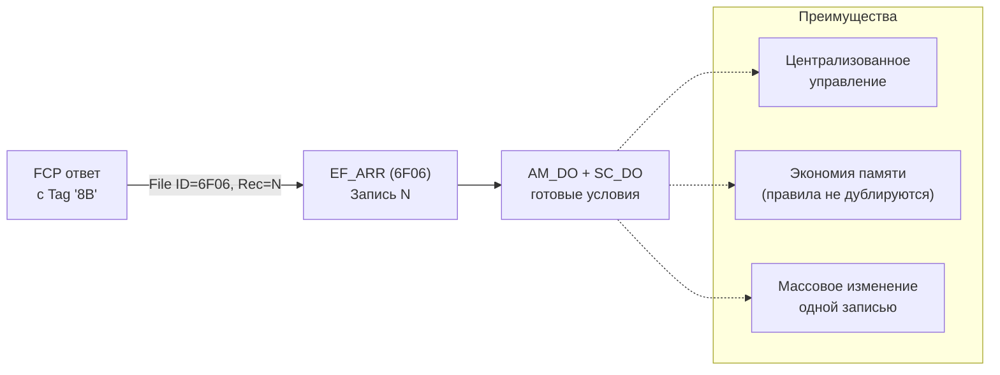
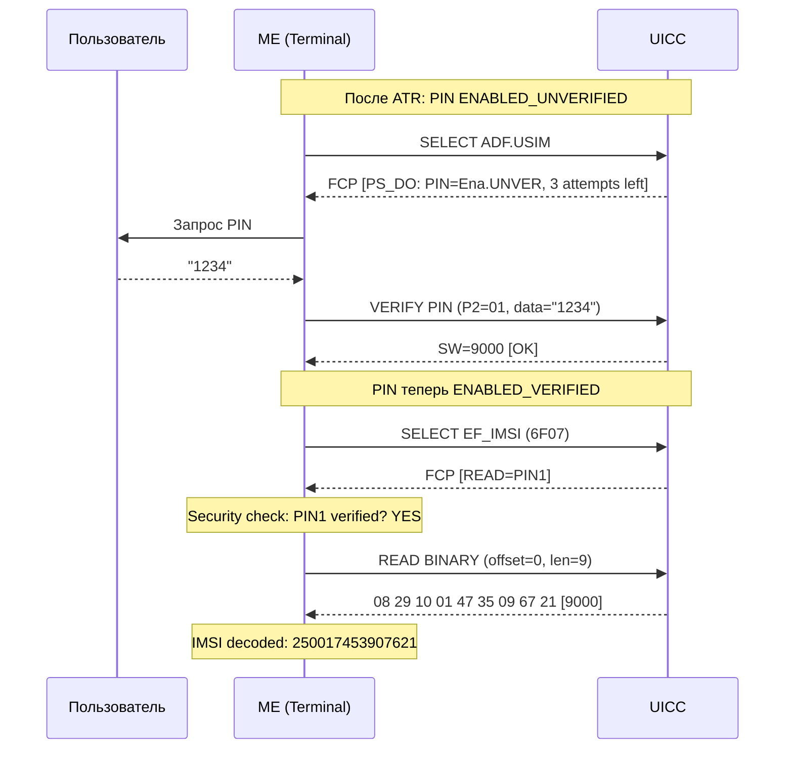

---
tags:
  - synthesis
  - SIM
  - UICC
  - security
  - PIN
  - PIN1
  - PIN2
  - PUK
  - ADM
  - access-control
  - VERIFY
  - EF_ARR
  - FCP
type: synthesis
created: 2026-06-12
updated: 2026-06-12
status: reviewed
sources:
  - "[[wiki/concepts/UICC_Security]]"
  - "[[wiki/summaries/ts_102221]]"
  - "[[wiki/summaries/ts_131102]]"
  - "[[wiki/summaries/gsm_1111]]"
  - "[[wiki/concepts/UICC_File_System]]"
  - "[[wiki/concepts/EF_Types]]"
  - "[[wiki/concepts/FCP]]"
---

# Права доступа и PIN-иерархия на SIM: PIN1, PIN2, ADM

> **Synthesis** -- всё о PIN-кодах, административном доступе и security conditions: иерархия, состояния, форматы и практические сценарии.

---

## 1. Кто есть кто: иерархия ключей

SIM-карта имеет **четыре уровня доступа**, каждый со своим ключом и назначением:

```
УРОВНИ ДОСТУПА:
═══════════════

┌─────────────────────────────────────────────────┐
│ Абонент                                          │
│   PIN1 (CHV1)      ПИН-код пользователя          │
│   PIN2 (CHV2)      Ограниченные функции (FDN,ACM) │
│   PUK1 / PUK2      Разблокировка PIN1 / PIN2     │
├─────────────────────────────────────────────────┤
│ Оператор                                         │
│   ADM              Административный доступ        │
│   Universal PIN    Общий PIN для всех приложений  │
├─────────────────────────────────────────────────┤
│ Сеть                                             │
│   AUTHENTICATE     Взаимная аутентификация        │
│                    (не PIN -- key-based)          │
└─────────────────────────────────────────────────┘
```

> [!info] CHV1 vs PIN1
> В GSM-терминологии PIN назывался **CHV** (Card Holder Verification). CHV1 = PIN1, CHV2 = PIN2. 3GPP перешёл на термин PIN, но в legacy-документации и коде CHV всё ещё встречается. Это одно и то же.

---

## 2. Детально: каждый PIN

### 2.1 PIN1 (CHV1) -- ключевая ссылка `01`

| Свойство | Значение |
|---|---|
| **Key Reference** | `01` (внутри ADF.USIM) |
| **Назначение** | Основная пользовательская аутентификация |
| **Длина** | 4-8 цифр (ITU-T T.50, кодируется на 8 байт) |
| **Попытки** | 3 попытки, затем BLOCKED |
| **Что защищает** | Большинство EF с SC=PIN1 (READ/UPDATE) |
| **Команда** | `VERIFY PIN` (CLA=00, INS=20, P2=01) |

PIN1 вводится при каждом включении телефона. После успешной верификации состояние меняется на ENABLED_VERIFIED -- все EF с SC=PIN1 становятся доступны.

### 2.2 PIN2 (CHV2) -- ключевая ссылка `02`

| Свойство | Значение |
|---|---|
| **Key Reference** | `02` |
| **Назначение** | Защита restricted-функций |
| **Длина** | 4-8 цифр (аналогично PIN1) |
| **Попытки** | 3 попытки, затем BLOCKED |
| **Что защищает** | FDN (Fixed Dialling Numbers), ACM (совет по оплате) |
| **Команда** | `VERIFY PIN` (CLA=00, INS=20, P2=02) |

PIN2 -- второй рубеж. Даже если PIN1 верифицирован, для записи в FDN или чтения ACM нужен отдельный PIN2. Обычный пользователь редко использует PIN2.

### 2.3 PUK1 и PUK2 -- разблокировка

| Свойство | PUK1 | PUK2 |
|---|---|---|
| **Назначение** | Разблокировать PIN1 | Разблокировать PIN2 |
| **Длина** | Ровно 8 цифр (фикс.) | Ровно 8 цифр (фикс.) |
| **Попытки** | 10 попыток | 10 попыток |
| **Команда** | `UNBLOCK PIN` (INS=2C, P2=01) | `UNBLOCK PIN` (INS=2C, P2=02) |
| **При исчерпании** | Карта **терминируется навсегда** | Карта **терминируется навсегда** |

> [!danger] Исчерпание PUK = смерть карты
> При 10 неудачных попытках PUK карта **навсегда** блокируется. Никакая команда не может её разблокировать. Это физический security fuse. Единственный выход -- замена SIM.

### 2.4 Universal PIN -- ключевая ссылка `11`

Специфичен для multi-application UICC (3G+). Universal PIN позволяет **одной верификацией** разблокировать доступ ко всем приложениям карты (USIM, ISIM, и др.).

| Свойство | Значение |
|---|---|
| **Key Reference** | `11` |
| **Назначение** | Единый PIN для всех приложений UICC |
| **Активация** | Через EF_UMPC (настройка multi-PIN на уровне MF) |
| **Эффект** | VERIFY с ref=11 даёт доступ к EF во всех ADF |

Если Universal PIN активен, Application PIN (ref `01` в ADF.USIM) может не запрашиваться -- Universal PIN его заменяет.

### 2.5 ADM -- административный доступ

ADM (ADMinistration) -- доступ для оператора или производителя. В отличие от PIN, ADM может быть реализован как:

- Секретный код (8-16 байт), передаваемый через `VERIFY PIN` с key reference 4-13
- Внешняя аутентификация (AUTHENTICATE с GSM-algorithm или GlobalPlatform SCP)
- Производственная аутентификация (только на заводе)

| Key Ref | Роль | Кто владеет |
|---|---|---|
| `04` | ADM1 | Производитель карты |
| `05`-`0A` | ADM2-ADM7 | Оператор (разные уровни) |
| `0B`-`0D` | ADM8-ADM10 | Оператор / производитель |

ADM позволяет: запись в EF с UPDATE=ADM (SPN, PLMN lists), персонализацию, OTA-конфигурацию, активацию/деактивацию сервисов.

---

## 3. Иерархия: кто кого может разблокировать



---

## 4. Состояния PIN: полная диаграмма

PIN проходит через три главных состояния. Переходы управляются командами VERIFY, DISABLE и UNBLOCK.



### Смысл состояний

| Состояние | Что означает | Поведение |
|---|---|---|
| **DISABLED** | PIN выключен пользователем (или производителем) | EF с SC=PIN1 **не требуют** верификации: доступны как ALW |
| **ENABLED_UNVERIFIED** | PIN включён, но не введён | EF с SC=PIN1 **заблокированы** до VERIFY |
| **ENABLED_VERIFIED** | PIN успешно введён | EF с SC=PIN1 доступны |
| **BLOCKED** | 3 неудачные попытки VERIFY | Требуется UNBLOCK PIN (PUK) |
| **TERMINATED** | PUK исчерпан | Карта физически заблокирована, восстановление невозможно |

---

## 5. Access Conditions: ALW, PIN1, PIN2, ADM, NEVER

### 5.1 Security Conditions (SC) -- допустимые значения

Каждый EF имеет свои **security attributes**, определяющие что требуется для выполнения операции. Базовый набор условий (SC):

| Код | Условие | Мнемоника | Описание |
|---|---|---|---|
| `0` | ALWays | **ALW** | Без ограничений -- операция разрешена всегда |
| `1` | PIN1 | **PIN1** (CHV1) | Требуется VERIFY PIN с key ref `01` |
| `2` | PIN2 | **PIN2** (CHV2) | Требуется VERIFY PIN с key ref `02` |
| `4` | ADM1 | **ADM** | Требуется административная аутентификация |
| `5-`A | ADM2-ADM9 | **ADMn** | Специализированные административные роли |
| `E` | AUTH | **AUTH** | Требуется внешняя аутентификация (между ME и UICC) |
| `F` | NEVer | **NEV** | Операция **запрещена всегда** |

> [!info] Коды 3, B-D
> Коды `3` и `B-D` зарезервированы (RFU -- Reserved for Future Use) и не должны использоваться. При встрече -- карта может отвергнуть доступ.

### 5.2 Типичные комбинации AM + SC

| Комбинация | Примеры EF | Смысл |
|---|---|---|
| **READ=ALW, UPDATE=ADM** | EF_SPN, EF_ECC | Читать могут все, менять -- только оператор |
| **READ=PIN1, UPDATE=ADM** | EF_PLMNwAcT, EF_OPLMNwACT | Пользователь видит, оператор настраивает |
| **READ=PIN1, UPDATE=PIN1** | EF_LOCI, EF_EPSLOCI | Телефон читает и пишет после регистрации |
| **READ=PIN1, UPDATE=NEVER** | EF_Keys, EF_KeysPS | Ключи можно прочесть (для отладки), но запись извне невозможна |
| **READ=ALW, UPDATE=NEVER** | EF_ICCID | Идентификатор виден всем, но менять -- невозможно |
| **READ=PIN2, UPDATE=PIN2** | EF_FDN | Только с PIN2 |
| **READ=ADM, UPDATE=ADM** | EF_SUCI_Calc_Info | Критическая конфигурация -- только оператор |
| **READ=ALW, UPDATE=PIN1** | EF_PLMNwAcT (вариант) | Пользователь редактирует свои предпочтения |

> [!example] Практическая трактовка
> `READ=PIN1, UPDATE=ADM` на EF_PLMNwAcT означает: "абонент может видеть список сетей, но только оператор может изменить порядок". Это защищает от случайного удаления роуминг-партнёров.

---

## 6. Форматы security attributes: Compact, Expanded, Referenced

Security attributes в FCP могут быть представлены в трёх форматах.

### 6.1 Compact Format (2 байта)

Самый простой формат -- один байт Access Mode (AM) + один байт Security Condition (SC).

```
AM byte + SC byte

Пример:
  AM = 0x04 (только UPDATE)
  SC = 0x01 (PIN1)
  → "Запись требует PIN1"
```

| Формат | Размер | Где используется | Ограничение |
|---|---|---|---|
| Compact | 2 байта | Legacy GSM, простые EF | Только одна операция защищена |

### 6.2 Expanded Format (BER-TLV)

Более гибкий -- каждая операция имеет свой SC. AM_DO (Tag `0x80`) и SC_DO (Tag `0x90`) кодируются в BER-TLV.

```
FCP Expanded Format:
  '80' LEN { AM1 AM2 ... }     ← Access Mode: битовая маска
  '90' LEN { SC1 SC2 ... }     ← Security Condition: по одному на каждый AM
       где SC1 = условие для AM1, SC2 = условие для AM2, ...

Пример:
  '80' 01 0C        ← AM = READ (0x08) + UPDATE (0x04)
  '90' 02 01 04     ← READ = PIN1 (01), UPDATE = ADM (04)
```

### 6.3 Referenced Format (EF_ARR)

Вместо встраивания security attributes в каждый EF, FCP содержит **ссылку** на запись в EF_ARR:

```
FCP Referenced Format:
  '8B' LEN {
      File ID = 0x6F06 (EF_ARR)
      Record Number = N
      [SEID = X]            ← опционально: Security Environment ID
  }
```

Механизм:



Подробнее об EF_ARR: [[sim_files_security|Безопасность через файлы: EF_ARR, EF_Keys, EF_ACC]].

---

## 7. Практический пример: VERIFY PIN -> READ EF

### Сценарий: телефон читает EF_IMSI после ввода PIN

```
Состояние до начала:
  - Карта включена после ATR
  - MF активен
  - PIN1 в состоянии ENABLED_UNVERIFIED
  - EF_IMSI имеет READ = PIN1

Шаги:

1. ME выбирает ADF.USIM
   -> 00 A4 04 00 09 A0 00 00 00 87 10 02 FF FF FF
   <- FCP (содержит PS_DO: PIN1=Ena.UNVER, осталось 3 попытки)
      Terminal понимает: нужен PIN

2. ME запрашивает PIN у пользователя
   Пользователь вводит: 1234 (или другой PIN)

3. ME отправляет VERIFY PIN
   -> 00 20 00 01 08 31 32 33 34 FF FF FF FF
      CLA=00 | INS=20 (VERIFY) | P1=00 | P2=01 (key ref=PIN1)
      Data: 8 байт (31 32 33 34 = "1234", остаток FF)
   <- SW=9000 (OK)

   [!] Альтернативный исход:
   <- SW=63 C3 (неверный PIN, осталось 3 попытки)
   <- SW=63 C1 (неверный PIN, осталось 1 попытка)
   <- SW=6983 (BLOCKED — PUK required)

4. ME выбирает EF_IMSI
   -> 00 A4 00 00 02 6F 07
   <- FCP (содержит security attributes: READ=PIN1)
      Состояние PIN: ENABLED_VERIFIED -> доступ разрешён

5. ME читает EF_IMSI
   -> 00 B0 00 00 09
   <- 08 29 10 01 47 35 09 67 21 9000
      (IMSI: 250017453907621)
```

### Полная диаграмма взаимодействия



### Что если PIN не тот?

```
Сценарий: неверный PIN

1. VERIFY PIN (P2=01, data="9999")  -- неверный
   <- SW=63 C2  (неверно, осталось 2 попытки)

2. VERIFY PIN (P2=01, data="8888")  -- снова неверный
   <- SW=63 C1  (неверно, осталось 1 попытка)

3. VERIFY PIN (P2=01, data="7777")  -- третья неверная
   <- SW=6983   (BLOCKED — authentication method blocked)

4. UNBLOCK PIN (PUK + новый PIN)
   -> 00 2C 00 01 10 <PUK 8 цифр> <новый PIN 8 цифр>
   <- SW=9000 [OK]

   [!] Если PUK неверен 10 раз:
   <- SW=6983 (TERMINATED — карта уничтожена)
```

---

## 8. Сводная таблица: все коды и команды

### Команды VERIFY и UNBLOCK

| Команда | INS | P1 | P2 | Data | Назначение |
|---|---|---|---|---|---|
| VERIFY PIN1 | `20` | `00` | `01` | 8 байт PIN | Верификация PIN1 |
| VERIFY PIN2 | `20` | `00` | `02` | 8 байт PIN | Верификация PIN2 |
| VERIFY ADM | `20` | `00` | `04` | 8+ байт | Верификация ADM |
| VERIFY Universal | `20` | `00` | `11` | 8 байт PIN | Верификация Universal PIN |
| CHANGE PIN1 | `24` | `00` | `01` | Old + New | Смена PIN1 |
| CHANGE PIN2 | `24` | `00` | `02` | Old + New | Смена PIN2 |
| UNBLOCK PIN1 | `2C` | `00` | `01` | PUK + New PIN | Разблокировка PIN1 |
| UNBLOCK PIN2 | `2C` | `00` | `02` | PUK + New PIN | Разблокировка PIN2 |
| DISABLE PIN1 | `26` | `00` | `01` | PIN | Выключение PIN1 |
| ENABLE PIN1 | `28` | `00` | `01` | PIN | Включение PIN1 |

### Статус-слова (SW)

| SW1 SW2 | Значение |
|---|---|
| `90 00` | OK -- операция успешна |
| `63 C0`-`63 CF` | Неверный PIN, осталось C? попыток (`63C3`=3, `63C0`=0) |
| `69 83` | Authentication method blocked (PIN заблокирован, нужен PUK) |
| `69 84` | Reference data invalidated (PUK исчерпан, карта терминирована) |
| `69 82` | Security status not satisfied (доступ к файлу без VERIFY) |
| `98 04` | PIN/PUK не найден (неверный key reference) |

---

## 9. Связи

### Внутренние концепты (wiki/)

- [[wiki/concepts/UICC_Security|UICC Security]] -- фундаментальная архитектура безопасности
- [[wiki/concepts/UICC_File_System|UICC File System]] -- где лежат EF с защитой
- [[wiki/concepts/FCP|File Control Parameters]] -- как UICC сообщает security attributes
- [[wiki/concepts/EF_Types|EF Types]] -- типы файлов и их защита
- [[wiki/concepts/APDU|APDU Commands]] -- VERIFY, UNBLOCK, READ/UPDATE

### Статьи каталога SIM-файлов

- [[sim_files_security|Безопасность через файлы: EF_ARR, EF_Keys, EF_ACC]] -- детально ARR-механизм и ключи
- [[sim_files_admin|Административные данные: EF_AD]] -- где задана длина PIN
- [[sim_files_emergency|Экстренные номера: EF_ECC]] -- EF доступные без PIN
- [[sim_filesystem_overview|SIM-карта как файловая система]] -- обзорная карта всех EF

### Specifications

- [[wiki/summaries/ts_102221|TS 102 221]] -- UICC: clause 11.1.11 (VERIFY PIN), clause 9 (security attributes)
- [[wiki/summaries/ts_131102|TS 31.102]] -- USIM: EF-specific access conditions
