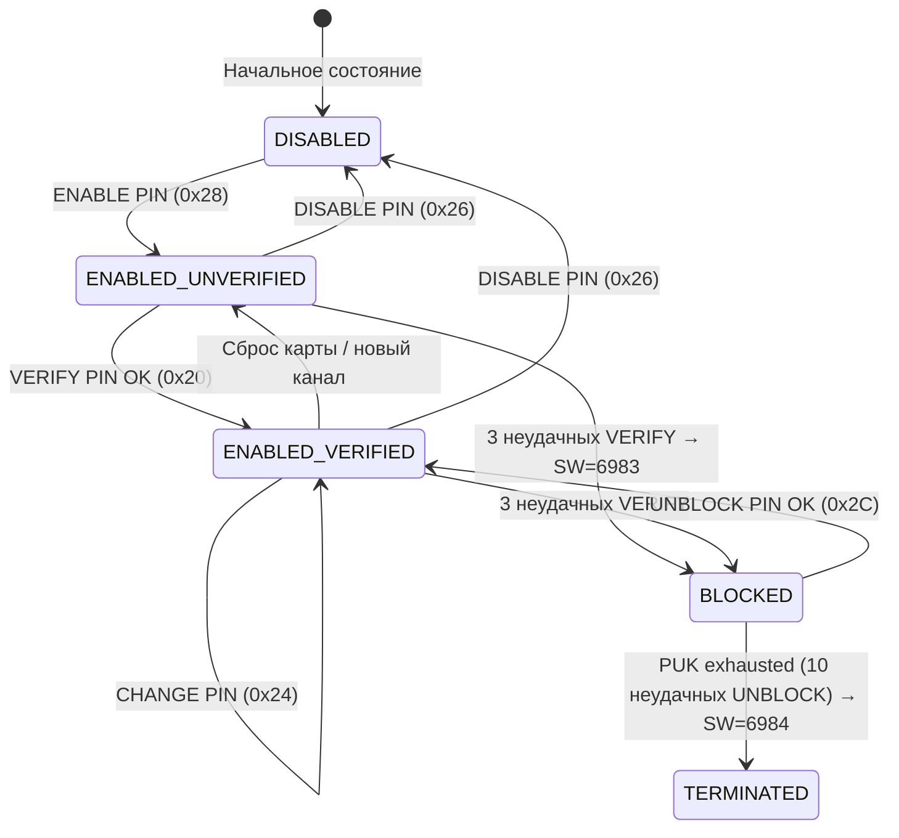
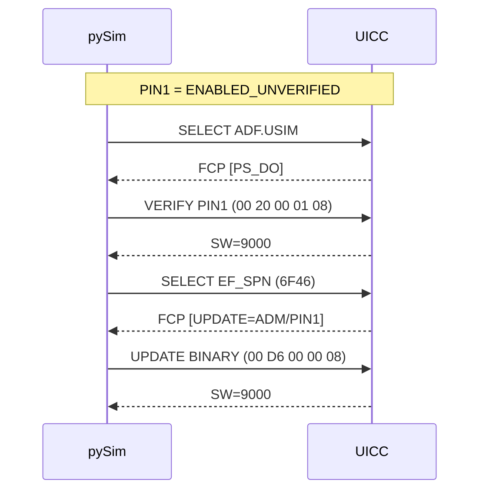

---
tags:
  - synthesis
  - SIM
  - UICC
  - security
  - PIN
  - PIN1
  - PIN2
  - PUK
  - ADM
  - APDU
  - VERIFY
  - UNBLOCK
  - pySim
  - access-control
type: synthesis
created: 2026-06-12
updated: 2026-06-12
status: reviewed
sources:
  - "[[wiki/concepts/UICC_Security]]"
  - "[[wiki/syntheses/sim_files_security]]"
  - "[[wiki/syntheses/sim_pin_access_control]]"
  - "[[wiki/reference/Status_Words]]"
  - "[[wiki/reference/CLA_INS_SFI]]"
  - "[[wiki/summaries/ts_102221]]"
  - "[[wiki/summaries/ts_131102]]"
---

# Система прав доступа на SIM: PIN1, PIN2, ADM с APDU-примерами

> **Synthesis** — практическое руководство по иерархии PIN/PUK/ADM на UICC: полный разбор APDU-команд, машина состояний PIN, сценарии и инструменты pySim.

---

## 1. PIN-иерархия

SIM-карта (UICC) реализует многоуровневую систему прав доступа. Каждый уровень — отдельный ключ со своим счётчиком попыток и последствиями исчерпания.

```
УРОВНИ ДОСТУПА К SIM

  ПОЛЬЗОВАТЕЛЬ:    PIN1 (KeyRef 01, 3 попытки)  |  PIN2 (KeyRef 02, 3 попытки)
  РАЗБЛОКИРОВКА:   PUK1/PUK2 (8 цифр, 10 попыток)
  АДМИНИСТРАТОР:   Universal PIN (KeyRef 11)  |  ADM1-9 (KeyRef 04-0A)
  СЕТЬ:            AUTHENTICATE (INS=0x88) — не PIN, криптографическая auth
```

### 1.1 PIN1 (CHV1) — Key Reference `01`

Основной рубеж пользовательской аутентификации. **CHV** (Card Holder Verification) — термин GSM, эквивалентный PIN в 3GPP.

| Свойство | Значение |
|---|---|
| **Key Reference** | `01` (в ADF.USIM / ADF.SIM) |
| **Длина** | 4-8 цифр (ITU-T T.50, передаётся как 8 байт) |
| **Попытки** | 3 VERIFY, затем BLOCKED |
| **Что защищает** | Большинство EF с SC = PIN1 (EF_IMSI, EF_LOCI, EF_SPN...) |
| **Команды** | VERIFY (`20`), CHANGE (`24`), DISABLE (`26`), ENABLE (`28`) |

### 1.2 PIN2 (CHV2) — Key Reference `02`

Второй, независимый рубеж для restricted-функций. Верифицированный PIN1 не даёт доступа к FDN/ACM — нужен отдельный VERIFY PIN2.

| Свойство | Значение |
|---|---|
| **Key Reference** | `02` |
| **Длина** | 4-8 цифр (аналогично PIN1) |
| **Попытки** | 3, затем BLOCKED |
| **Что защищает** | EF_FDN (Fixed Dialling Numbers), EF_ACM (Accumulated Call Meter) |

> [!info] PIN1 и PIN2 — независимые счётчики
> Три неудачных PIN1 не влияют на статус PIN2, и наоборот. PUK1 и PUK2 также изолированы.

### 1.3 PUK1 и PUK2

PUK (Personal Unblocking Key) — единственный способ разблокировать PIN.

| Свойство | PUK1 | PUK2 |
|---|---|---|
| **Длина** | Ровно 8 цифр | Ровно 8 цифр |
| **Попытки** | 10 | 10 |
| **Команда** | UNBLOCK PIN (`2C`, P2=`01`) | UNBLOCK PIN (`2C`, P2=`02`) |
| **При исчерпании** | `69 84` — карта терминирована | `69 84` |

> [!danger] PUK exhausted = карта уничтожена
> При 10 неудачных попытках PUK карта безвозвратно блокируется (SW=`69 84`). Это аппаратный security fuse — восстановление невозможно. Единственный выход — замена SIM у оператора.

### 1.4 Universal PIN — Key Reference `11`

Специфичен для multi-application UICC (3GPP Rel-7+). Одна верификация (ref `11`) разблокирует доступ ко всем EF с SC=PIN1 **во всех ADF** (USIM, ISIM, CSIM). Настраивается в EF_UMPC на уровне MF. Поддерживается не всеми картами.

### 1.5 ADM — административный доступ (Key Ref `04`–`0A`)

Доступ оператора/производителя. Реализуется как секретный код (`VERIFY PIN`), `EXTERNAL AUTHENTICATE` (INS=`82`) или GlobalPlatform SCP-сессия.

| Key Ref | Роль | Кто владеет | Операции |
|---|---|---|---|
| `04` | ADM1 | Производитель | CREATE/DELETE FILE, UPDATE=ADM |
| `05` | ADM2 | Оператор ур.1 | EF_SPN, EF_PLMNwAcT, OTA |
| `06` | ADM3 | Оператор ур.2 | EF_ACC, персонализация |
| `07`–`0A` | ADM4-7 | Оператор (спец.) | Специфические сервисы |

---

## 2. APDU-команды для PIN: полный разбор

Все PIN-команды используют `CLA=00` (3GPP inter-industry). Key Reference передаётся в P2.

### Сводная таблица команд

| Команда | INS | P1 | P2 | Lc | Data | SW OK | SW fail |
|---|---|---|---|---|---|---|---|
| **VERIFY PIN1** | `20` | `00` | `01` | `08` | PIN (8B, padding FF) | `9000` | `63CX`, `6983` |
| **VERIFY PIN2** | `20` | `00` | `02` | `08` | PIN (8B) | `9000` | `63CX`, `6983` |
| **VERIFY ADM** | `20` | `00` | `04` | вар. | ADM (8-16B) | `9000` | `63CX`, `6983` |
| **VERIFY Univ.** | `20` | `00` | `11` | `08` | PIN (8B) | `9000` | `63CX`, `6983` |
| **CHANGE PIN1** | `24` | `00` | `01` | `10` | Old+New (каждый 8B) | `9000` | `6982`, `63CX` |
| **CHANGE PIN2** | `24` | `00` | `02` | `10` | Old+New (каждый 8B) | `9000` | `6982`, `63CX` |
| **DISABLE PIN1** | `26` | `00` | `01` | `08` | PIN (8B) | `9000` | `63CX` |
| **ENABLE PIN1** | `28` | `00` | `01` | `08` | PIN (8B) | `9000` | `63CX` |
| **UNBLOCK PIN1** | `2C` | `00` | `01` | `10` | PUK+New (каждый 8B) | `9000` | `63CX`, `6984` |
| **UNBLOCK PIN2** | `2C` | `00` | `02` | `10` | PUK+New (каждый 8B) | `9000` | `63CX`, `6984` |

### Кодирование PIN (ITU-T T.50)

PIN всегда передаётся как **ровно 8 байт** — фиксированная длина предотвращает timing attacks. Цифры кодируются `0x3N` (ASCII), остаток заполняется `0xFF`:

```
"1234" → 31 32 33 34 FF FF FF FF → 00 20 00 01 08 31 32 33 34 FF FF FF FF
```

### Детали ключевых команд

- **VERIFY** (`00 20`): P2 = Key Ref. Ответ `63 CX` — warning: `X` = оставшиеся попытки (0 = BLOCKED, `69 83`).
- **CHANGE** (`00 24`): меняет PIN. Требует VERIFY (иначе `69 82`). Данные: 16B = старый (8B) + новый (8B).
- **UNBLOCK** (`00 2C`): разблокирует BLOCKED-карту. Данные: 16B = PUK (8B) + новый PIN (8B). При успехе сбрасывает оба счётчика (PIN → 3, PUK → 10). При 10-й неудаче: `69 84` — карта терминирована.
- **DISABLE/ENABLE** (`00 26` / `00 28`): выключает/включает проверку PIN. После DISABLE все EF с SC=PIN1 доступны без верификации (полезно для IoT).
- **VERIFY ADM**: та же `00 20`, P2 = `04`–`0A`, длина переменная (8-16B). Обычно без PUK.

---

## 3. Машина состояний PIN



| Состояние | VERIFY принят? | EF с SC=PIN1 доступны? | Как выйти |
|---|---|---|---|
| **DISABLED** | Да (переход в VERIFIED) | Да — как ALW | ENABLE PIN |
| **ENABLED_UNVERIFIED** | Да | Нет — `69 82` | VERIFY PIN |
| **ENABLED_VERIFIED** | Да (подтверждение) | Да | Сброс карты / DISABLE |
| **BLOCKED** | Нет — `69 83` | Нет — `69 83` | UNBLOCK PIN (PUK) |
| **TERMINATED** | Нет — `69 84` | Нет — `69 84` | Невозможно |

> [!important] VERIFIED — состояние логического канала
> ENABLED_VERIFIED привязано к каналу. На новом канале PIN снова ENABLED_UNVERIFIED. Universal PIN (ref `11`) и SEID могут разделять состояние между каналами на multi-verification UICC.

---

## 4. PIN в pySim: справочник команд

| Команда pySim-shell | APDU | Назначение |
|---|---|---|
| `verify_chv` | `00 20 00 01 08 <PIN>` | VERIFY PIN1 |
| `verify_chv --chv 2` | `00 20 00 02 08 <PIN>` | VERIFY PIN2 |
| `change_chv` | `00 24 00 01 10 <old><new>` | CHANGE PIN1 |
| `disable_chv` | `00 26 00 01 08 <PIN>` | DISABLE PIN1 |
| `enable_chv` | `00 28 00 01 08 <PIN>` | ENABLE PIN1 |
| `unblock_chv` | `00 2C 00 01 10 <PUK><NEW>` | UNBLOCK PIN1 |
| `unblock_chv --chv 2` | `00 2C 00 02 10 <PUK><NEW>` | UNBLOCK PIN2 |
| `verify_adm` | `00 20 00 04 <Lc> <ADM>` | VERIFY ADM |

**Информационные команды:**
```bash
pySIM-shell> get_data 0x00C6    # PIN Status DO на MF (оставшиеся попытки, состояние)
pySIM-shell> get_data 0x00C0    # PIN Status Template на ADF
pySIM-shell> status             # Информация о текущем DF (включая PS_DO)
```

**Запуск с ADM и скриптинг:**
```bash
pySim-shell -p 0 --adm 0000000000000000

# Скрипт: полный цикл PIN
cat << 'EOF' | pySim-shell -p 0
select ADF.USIM
verify_chv          # VERIFY PIN1
select EF_IMSI
read_binary 9       # Чтение IMSI (требует VERIFIED PIN1)
EOF
```

---

## 5. Типичные сценарии

### 5.1 Запись в EF_SPN (требует PIN1 или ADM)



Без VERIFY: `69 82` (Security status not satisfied).

### 5.2 Запись в EF_FDN (требует PIN2!)

```
Операция: UPDATE RECORD на EF_FDN (6F3B)
Состояние: PIN1=VERIFIED, PIN2=ENABLED_UNVERIFIED

00 DC 00 01 0E <FDN entry>  →  SW=69 82 ❌
   ↑ PIN1 verified, но EF_FDN требует PIN2!

00 20 00 02 08 <PIN2>       →  SW=90 00   (VERIFY PIN2)
00 DC 00 01 0E <FDN entry>  →  SW=90 00 ✅
```

### 5.3 Создание файла (требует ADM)

Только на программируемых картах (sysmoUSIM, TCA Loader):

```
VERIFY ADM:  00 20 00 04 08 <ADM>  →  SW=9000
CREATE FILE: 00 E0 00 00 1A <FCP>  →  SW=9000
```

### 5.4 Три неудачных PIN → BLOCKED → PUK

```
VERIFY "9999" → 63 C3 (3 left)  |  VERIFY "8888" → 63 C1 (1 left!) ⚠️
VERIFY "7777" → 69 83 (BLOCKED)  🔒
UNBLOCK: 00 2C 00 01 10 <PUK><NEW> → 90 00 ✅
```

### 5.5 PUK exhausted → PERMANENT BLOCK

```
UNBLOCK 1-9: неверный PUK → 63 C9..63 C1
UNBLOCK 10:  неверный PUK → 69 84 💀 TERMINATED
Все дальнейшие команды → 69 84. Восстановление невозможно.
```

---

## 6. SW1SW2 для PIN-операций

| SW | Категория | Значение | Действие |
|---|---|---|---|
| `90 00` | Normal | OK | Продолжить |
| `63 C0` | Warning | Неверный PIN, 0 попыток → BLOCKED | UNBLOCK PIN |
| `63 C1` | Warning | Неверный PIN, осталась 1 попытка | **Критично:** последняя! |
| `63 C2` | Warning | Неверный PIN, 2 попытки | Предупредить |
| `63 C3` | Warning | Неверный PIN, 3 попытки | Обычное |
| `63 C9`–`63 C1` | Warning | Неверный PUK, 9-1 попыток | Сообщить остаток |
| `69 82` | Checking | Security status not satisfied | VERIFY PIN сначала |
| `69 83` | Checking | Authentication method blocked (PIN) | UNBLOCK PIN (PUK) |
| `69 84` | Checking | Referenced data invalidated (PUK exhausted) | Замена SIM |
| `98 04` | Application | Access condition not fulfilled | Проверить P2 / права |
| `6A 80` | Checking | Incorrect data field params | Длина PIN должна быть 8B |
| `6A 86` | Checking | Incorrect P1-P2 | Исправить P2 |
| `67 00` | Checking | Wrong Lc length | Lc=8 (VERIFY), Lc=16 (CHANGE/UNBLOCK) |

### Интерпретация 63 CX по типу операции

| Операция | 63 C3–C1 | 63 C0 | 63 C9–C1 |
|---|---|---|---|
| VERIFY / CHANGE PIN | Неверный PIN, X попыток VERIFY | PIN → BLOCKED | — |
| UNBLOCK PIN | — | — | Неверный PUK, X попыток PUK |

---

## 7. Безопасность: лучшие практики

### 7.1 Никогда не хранить PIN в открытом виде

```python
# ❌ ПЛОХО
pin = "1234"; pin = os.environ["SIM_PIN"]

# ✅ ХОРОШО
pin = secrets_manager.get_secret("sim_pin_1")
pin = getpass.getpass("Enter SIM PIN: ")
```

### 7.2 Кодирование PIN (всегда 8 байт, padding `FF`)

```python
def encode_pin(pin_str: str) -> bytes:
    if not (4 <= len(pin_str) <= 8):
        raise ValueError("PIN must be 4-8 digits")
    return bytes([0x30 + int(c) for c in pin_str]).ljust(8, b'\xFF')

assert encode_pin("1234") == bytes([0x31,0x32,0x33,0x34,0xFF,0xFF,0xFF,0xFF])
```

`0xFF` — единственный байт, не конфликтующий с кодами цифр ITU-T T.50 (`0x30`–`0x39`). Фиксированная длина предотвращает timing attacks.

### 7.3 Проверка остатка попыток и аудит

```python
# Проверка PS_DO перед VERIFY (из FCP после SELECT)
remaining, state = get_pin_status(card, key_ref=1)
if remaining == 1:
    print("ВНИМАНИЕ: последняя попытка!")

# Логирование: факт и результат — НИКОГДА не сам PIN
logger.info(f"VERIFY PIN: ref={key_ref:02X}, attempts_before={remaining}")
sw1, sw2 = card.verify_chv(key_ref, encoded_pin)
if sw1 == 0x63:
    logger.warning(f"FAILED: {sw2 & 0x0F} attempts left")
elif sw1 == 0x69:
    logger.critical(f"PIN {'BLOCKED' if sw2 == 0x83 else 'TERMINATED'}")
```

### 7.5 Рекомендации по средам

| Среда | PIN1 | ADM | PUK |
|---|---|---|---|
| **Разработка** (тестовые) | DISABLED | В менеджере паролей | Записан |
| **CI/CD** | DISABLED | В secrets vault | Не используется |
| **Production IoT** | DISABLED (после provisioning) | В HSM | В HSM оператора |
| **Production Consumer** | ВКЛЮЧЁН | Только у оператора | На пластике у пользователя |

---

## 8. Связи

### wiki/

- [[wiki/concepts/UICC_Security|UICC Security]] — фундаментальная архитектура безопасности UICC
- [[wiki/syntheses/sim_files_security|Безопасность через файлы: EF_ARR, EF_Keys, EF_ACC]] — security attributes в файловой системе
- [[wiki/syntheses/sim_pin_access_control|Права доступа и PIN-иерархия на SIM]] — общий обзор иерархии и security conditions
- [[wiki/reference/Status_Words|Status Words (SW1 SW2)]] — полная таблица кодов ответов
- [[wiki/reference/CLA_INS_SFI|CLA, INS, SFI]] — кодирование байтов APDU
- [[wiki/concepts/UICC_File_System|UICC File System]] — расположение защищённых EF
- [[wiki/concepts/FCP|File Control Parameters]] — как UICC сообщает security attributes терминалу
- [[wiki/concepts/APDU|APDU Commands]] — структура команд и ответов

### Specifications

- [[wiki/summaries/ts_102221|ETSI TS 102 221]] — UICC: clause 11.1.11 (VERIFY PIN), clause 9 (security attributes), PS_DO
- [[wiki/summaries/ts_131102|3GPP TS 31.102]] — USIM: access conditions для каждого EF
- [[wiki/summaries/gsm_1111|GSM 11.11]] — Legacy CHV1/CHV2 (исторический контекст)
