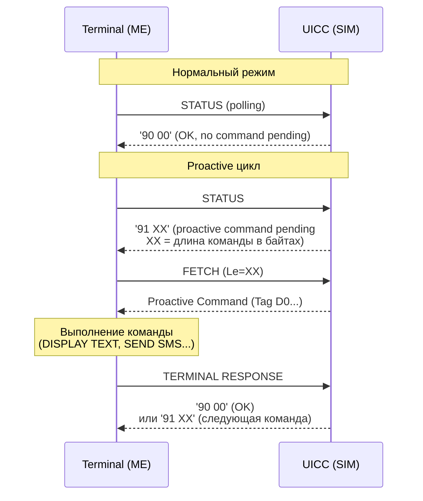

---
tags:
  - STK
  - CAT
  - USAT
  - proactive
  - JavaCard
  - reference
  - catalog
  - BER-TLV
type: synthesis
created: 2026-06-12
updated: 2026-06-12
status: reviewed
sources:
  - "[[wiki/concepts/CAT_STK|CAT/STK — Card Application Toolkit]]"
  - "[[wiki/concepts/STK_Applet|STK Applet Development]]"
  - "[[wiki/summaries/ts_102223|ETSI TS 102 223 — CAT]]"
  - "[[wiki/summaries/sjors_gielen_stk|SIM Toolkit in Practice (2012)]]"
  - "[[wiki/summaries/ruimtools_javacard_samples|RuimTools JavaCard Samples]]"
  - "[[wiki/reference/JavaCard_APIs|JavaCard API & GP Commands]]"
  - "[[wiki/syntheses/cell_broadcast_pws_applet|PWS/CMAS Applet]]"
---

# SIM Toolkit: Полный каталог Proactive команд

> **Synthesis** — исчерпывающий справочник по всем proactive командам SIM Toolkit (CAT/STK/USAT): коды, qualifier'ы, BER-TLV структура, примеры на JavaCard, типичные ошибки, совместимость с устройствами.

---

## 1. Введение

### 1.1 Что такое Proactive Commands

**Proactive Command** — это команда, которую UICC (SIM-карта) отправляет терминалу (телефону) с инструкцией выполнить определённое действие. В отличие от обычного режима (терминал командует, UICC отвечает), в проактивном режиме **UICC инициирует действие**, а терминал его исполняет и докладывает результат. ^[extracted]

Этот механизм лежит в основе SIM Toolkit (STK) в GSM, USAT (USIM Application Toolkit) в 3GPP и CAT (Card Application Toolkit) в ETSI. Определён в [[wiki/summaries/ts_102223|ETSI TS 102 223]].

### 1.2 Проактивный цикл



> [!tip] Ключевой принцип
> UICC всегда остаётся во **вторичной роли** (secondary role). Терминал инициирует каждый обмен через STATUS и FETCH. UICC лишь сигнализирует о готовности команды через статусные байты `91 XX`.

### 1.3 Структура Proactive Command (BER-TLV)

Каждая proactive команда кодируется в BER-TLV внутри тега `D0`:

```
Tag: D0 (Proactive UICC Command)
├─ Command Details (Tag 81):    обязательный
│   ├─ Command Number (1 байт):  уникальный номер команды в сессии
│   ├─ Command Type (1 байт):    код команды (0x21=DISPLAY TEXT, ...)
│   └─ Command Qualifier (1 байт): параметры выполнения
├─ Device Identities (Tag 82):  обязательный
│   ├─ Source Device:  UICC (81) или ME (82)
│   └─ Destination Device: Display (02), ME (82), Network (83)...
└─ Command-specific data:       зависит от команды
    ├─ Alpha Identifier (Tag 05)  — заголовок
    ├─ Text String (Tag 0D)       — текст для DISPLAY TEXT
    ├─ Address (Tag 06)           — телефонный номер
    ├─ URL (Tag 31)               — ссылка для LAUNCH BROWSER
    ├─ Item (Tag 0F)              — пункт меню/списка
    └─ ... (прочие теги)
```

### 1.4 Обозначения в каталоге

- **Код**: номер команды в поле Type of Command (Tag 81, байт 2)
- **Qualifier**: битовое поле в байте 3 Tag 81. Биты кодируют приоритет, формат, режим отображения
- **Device IDs**: Source/Destination из Tag 82
- **CR**: Comprehension Required флаг (0x80) — тег обязателен к пониманию
- **TP Bit**: байт и бит в TERMINAL PROFILE, который должен быть установлен для поддержки
- **Константа JavaCard**: `ToolkitConstants.PRO_CMD_*`

---

## 2. Каталог Proactive команд

### 2.1 Пользовательский интерфейс (6 команд)

#### DISPLAY TEXT / `0x21`

| Параметр | Значение |
|---|---|
| Код | `0x21` |
| Константа JC | `PRO_CMD_DISPLAY_TEXT` |
| TP Bit | Byte 1, Bit 7 |
| Target Device | Display (`0x02`), ME (`0x82`) |

**Qualifier:**

| Биты | Значение |
|---|---|
| b8 | `0` = Normal priority; `1` = High priority |
| b7 | Bit 1 = Clear message after delay |
| b6 | Bit 2 = Wait for user to clear |
| b5-b4 | `00` = SMS default alphabet; `01` = UCS2; `10` = 8-bit; `11` = Reserved |
| b3-b1 | `000` = Normal; `001`/`010` = Text Attribute present |
| b1 | `0` = Immediate display; `1` = Packed in SMS format (GSM 7-bit) |

**BER-TLV теги:**

| Тег | Название | CR | Назначение |
|---|---|---|---|
| `05` | Alpha Identifier | No | Заголовок окна |
| `0D` | Text String | Yes | Основной текст + DCS |
| `0E` | Icon Identifier | No | Иконка |
| `10` | Text Attribute | No | Цвет, шрифт, размер |

**TLV структура (hex):**
```
D0 Len
  81 03 01 21 QQ    ← Command Details: CmdNum=01, Type=21, Qualifier=QQ
  82 02 81 02       ← Device: UICC→Display
  8D LL DCS DATA...  ← Text String (8D = 0D | 0x80)
```

**JavaCard код:**
```java
ProactiveHandler ph = ProactiveHandler.getTheHandler();

// Normal priority, clear after delay, SMS default alphabet
ph.init(PRO_CMD_DISPLAY_TEXT,(byte)0x00, DEV_ID_DISPLAY);
ph.appendTLV((byte)(TAG_TEXT_STRING | 0x80), DCS_8_BIT_DATA,
             text, (short)0, (short)text.length);
ph.send();

// High priority, wait for user to clear
ph.init(PRO_CMD_DISPLAY_TEXT,(byte)0x81, DEV_ID_DISPLAY);
ph.appendTLV((byte)(TAG_TEXT_STRING | 0x80), DCS_8_BIT_DATA,
             urgentText, (short)0, (short)urgentText.length);
ph.send();
```

**Типичные ошибки:**

| Ошибка | Причина | Решение |
|---|---|---|
| DISPLAY TEXT не показывается | TP Byte 1 Bit 7 = 0 | Проверить TERMINAL PROFILE |
| `6F XX` (internal error) | Слишком длинный текст (>240 байт) | Обрезать до 240 символов |
| Текст обрезается | Размер экрана терминала меньше текста | Использовать `PROVIDE LOCAL INFORMATION (IMEI)` для определения модели |
| Reentrance conflict | `WAIT_FOR_USER` блокирует сессию | Не отправлять другие proactive команды пока висит DISPLAY TEXT |

> [!warning] Опасность WAIT_FOR_USER
> С qualifier'ом `WAIT_FOR_USER` (b6=1) DISPLAY TEXT блокирует проактивную сессию до тех пор, пока пользователь не нажмёт "OK". Это может создать reentrance-конфликты с другими апплетами на той же карте.

---

#### GET INKEY / `0x22`

| Параметр | Значение |
|---|---|
| Код | `0x22` |
| Константа JC | `PRO_CMD_GET_INKEY` |
| TP Bit | Byte 1, Bit 6 |
| Target Device | ME (`0x82`) |

**Qualifier:**

| Биты | Значение |
|---|---|
| b8 | `0` = Digits only (0-9, *, #); `1` = Alphabet set |
| b7 | `0` = SMS default alphabet; `1` = UCS2 |
| b6 | `0` = User input echo; `1` = Hidden input (***) |
| b5 | `0` = Yes/No response; `1` = Character set response |
| b4 | `0` = No help; `1` = Help information available |

**BER-TLV теги:**

| Тег | Название | CR | Назначение |
|---|---|---|---|
| `05` | Alpha Identifier | No | Текст запроса |
| `0E` | Icon Identifier | No | Иконка |
| `0F` | Text Attribute | No | Атрибуты текста |
| `11` | Frame ID | No | Номер фрейма |

**JavaCard код:**
```java
// Запросить 1 цифру
ph.init(PRO_CMD_GET_INKEY,(byte)0x00, DEV_ID_ME);
ph.appendTLV(TAG_ALPHA_IDENTIFIER,
             promptBytes, (short)0, (short)promptBytes.length);
ph.send();

// Читаем результат в ProactiveResponseHandler
ProactiveResponseHandler resp = ProactiveResponseHandler.getTheHandler();
byte result = resp.getGeneralResult();       // '00' = OK
// TERMINAL RESPONSE содержит Text String с нажатой клавишей
byte[] respBuf = resp.getData();
byte keyPressed = respBuf[0];  // первый байт = символ
```

**Типичные ошибки:**

| Ошибка | Причина | Решение |
|---|---|---|
| Terminal Response = `01` (user abort) | Пользователь нажал Cancel | Обработать gracefully |
| Terminal Response = `02` (no response) | Пользователь не ответил за таймаут | Установить разумное ожидание |
| Полученный символ не соответствует ожидаемому | SMS alphabet vs UCS2 confusion | Проверить qualifier b7 |

---

#### GET INPUT / `0x23`

| Параметр | Значение |
|---|---|
| Код | `0x23` |
| Константа JC | `PRO_CMD_GET_INPUT` |
| TP Bit | Byte 1, Bit 5 |
| Target Device | ME (`0x82`) |

**Qualifier:**

| Биты | Значение |
|---|---|
| b8 | `0` = Digits only; `1` = Alphabet set |
| b7 | `0` = SMS default alphabet; `1` = UCS2 |
| b6 | `0` = User input visible; `1` = Hidden input |
| b5 | `0` = No help; `1` = Help available |

**BER-TLV теги:**

| Тег | Название | CR | Назначение |
|---|---|---|---|
| `05` | Alpha Identifier | No | Текст запроса |
| `11` | Text String | No | Ответ по умолчанию |
| `0D` | Response Length | Yes | Min (1 байт) + Max (1 байт) длина ответа |
| `0E` | Icon Identifier | No | Иконка |
| `0F` | Text Attribute | No | Атрибуты текста |

**JavaCard код:**
```java
byte[] prompt = {'E','n','t','e','r',' ','P','I','N',':'};

ph.init(PRO_CMD_GET_INPUT,(byte)0x01, DEV_ID_ME);  // alphabet, visible
ph.appendTLV(TAG_ALPHA_IDENTIFIER,
             prompt, (short)0, (short)prompt.length);
// Response length: min 4, max 8 символов
byte[] respLen = {0x04, 0x08};
ph.appendTLV((byte)(TAG_RESPONSE_LENGTH | 0x80),
             respLen, (short)0, (short)2);
ph.send();
```

**Типичные ошибки:**

| Ошибка | Причина | Решение |
|---|---|---|
| Ответ не умещается в Response Length | Min/Max указаны неверно | Проверить ограничения длины |
| GET INPUT не показывается | Terminal не поддерживает GET INPUT | Проверить TP Byte 1 Bit 5 |
| Hidden input не работает на некоторых телефонах | Некоторые терминалы игнорируют b6=1 | Всегда проверять результат |

---

#### PLAY TONE / `0x25`

| Параметр | Значение |
|---|---|
| Код | `0x25` |
| Константа JC | `PRO_CMD_PLAY_TONE` |
| TP Bit | Byte 1, Bit 4 |
| Target Device | Earpiece (`0x03`), ME (`0x82`) |

**Qualifier (тип тона):**

| Qualifier | Тон |
|---|---|
| `0x01` | Dial tone |
| `0x02` | Called subscriber busy |
| `0x03` | Congestion |
| `0x04` | Radio path acknowledge (beep) |
| `0x05` | Radio path not available / Call dropped |
| `0x06` | Error / Special information |
| `0x07` | Call waiting tone |
| `0x08` | Ringing tone |
| `0x10` | General beep (short) |
| `0x11` | Positive acknowledgement tone |
| `0x12` | Negative acknowledgement / Error tone |
| `0x20` | Vibrate alert (on/off) |

**BER-TLV теги:**

| Тег | Название | CR | Назначение |
|---|---|---|---|
| `05` | Alpha Identifier | No | Текст-сопровождение |
| `0E` | Icon Identifier | No | Иконка |

**JavaCard код:**
```java
// Воспроизвести beep
ph.init(PRO_CMD_PLAY_TONE,(byte)0x10, DEV_ID_ME);
ph.send();

// Воспроизвести dial tone
ph.init(PRO_CMD_PLAY_TONE,(byte)0x01, DEV_ID_ME);
ph.send();
```

> [!note] Vibrate alert
> Qualifier `0x20` управляет вибромотором: `0x20` = включить, `0x21` = выключить. Поддерживается не всеми терминалами.

---

#### SET UP IDLE MODE TEXT / `0x28` (2G) / `0x36` (3G+)

| Параметр | Значение |
|---|---|
| Код | `0x28` (2G), `0x36` (3G+) |
| Константа JC | `PRO_CMD_SET_UP_IDLE_MODE_TEXT` |
| TP Bit | Byte 3, Bit 2 |
| Target Device | Display (`0x02`) |

**BER-TLV теги:**

| Тег | Название | CR | Назначение |
|---|---|---|---|
| `05` | Alpha Identifier | No | Заголовок |
| `0D` | Text String | Yes | Текст на idle-экране |
| `0E` | Icon Identifier | No | Иконка |
| `0F` | Text Attribute | No | Атрибуты текста |

**JavaCard код:**
```java
byte[] operatorName = {'M','y',' ','O','p','e','r','a','t','o','r'};
ph.init(PRO_CMD_SET_UP_IDLE_MODE_TEXT,(byte)0x00, DEV_ID_DISPLAY);
ph.appendTLV((byte)(TAG_TEXT_STRING | 0x80), DCS_8_BIT_DATA,
             operatorName, (short)0, (short)operatorName.length);
ph.send();
```

> [!tip] Регистрация на событие
> Для использования SET UP IDLE MODE TEXT необходимо подписаться на событие `EVENT_IDLE_SCREEN_AVAILABLE` через SET UP EVENT LIST. Без этого текст не отобразится.

---

#### LANGUAGE NOTIFICATION / `0x35` (2G) / `0x39` (3G+)

| Параметр | Значение |
|---|---|
| Код | `0x35` (2G), `0x39` (3G+) |
| Константа JC | `PRO_CMD_LANGUAGE_NOTIFICATION` |
| TP Bit | Byte 3, Bit 4 |
| Target Device | ME (`0x82`) |

**BER-TLV теги:**

| Тег | Название | CR | Назначение |
|---|---|---|---|
| `05` | Alpha Identifier | No | Заголовок |
| `2D` | Language | Yes | Код языка (ISO 639) |

**JavaCard код:**
```java
// Сообщить терминалу язык UICC (немецкий = "de")
byte[] language = {'d','e'};
ph.init(PRO_CMD_LANGUAGE_NOTIFICATION,(byte)0x00, DEV_ID_ME);
ph.appendTLV((byte)0x2D, language, (short)0, (short)2);
ph.send();
```

---

### 2.2 Меню и навигация (3 команды)

#### SET UP MENU / `0x25` (2G) / `0x28` (3G+)

| Параметр | Значение |
|---|---|
| Код | `0x25` (2G), `0x28` (3G+) |
| Константа JC | `PRO_CMD_SET_UP_MENU` |
| TP Bit | Byte 1, Bit 3 |
| Target Device | ME (`0x82`) |

**Qualifier:**

| Биты | Значение |
|---|---|
| b8 | `0` = Menu item not selected by user; `1` = Item selected (в Term Resp) |
| b7 | `0` = Remove existing menu; `1` = Use existing menu and add items |
| b6 | `0` = No help; `1` = Help available |

**BER-TLV теги:**

| Тег | Название | CR | Назначение |
|---|---|---|---|
| `05` | Alpha Identifier | Yes | Название меню |
| `0F` | Item (повтор.) | Yes | Пункты меню: Item ID (1 байт) + Item Text |
| `0E` | Icon Identifier | No | Иконка меню |
| `1E` | Item Icon Identifier List | No | Иконки для пунктов |
| `10` | Text Attribute | No | Атрибуты текста |
| `11` | Next Action Indicator | No | Что делать после выбора |

**TLV структура (hex):**
```
D0 2C
  81 03 01 28 00       ← CmdNum=01, Type=28, Qualifier=00
  82 02 81 82          ← UICC→ME
  85 0A 4D 79 20 4D 65 6E 75 31 30  ← Alpha ID: "My Menu10"
  8F 08 01 49 74 65 6D 20 31          ← Item 1 (ID=01): "Item 1"
  8F 08 02 49 74 65 6D 20 32          ← Item 2 (ID=02): "Item 2"
```

**JavaCard код (через ToolkitRegistry):**
```java
private StkApplet() {
    ToolkitRegistry tr = ToolkitRegistry.getEntry();
    byte[] menuTitle = {'M','y',' ','M','e','n','u'};
    tr.initMenuEntry(menuTitle, (short)0, (short)7,
                     (byte)0,       // qualifier
                     false,          // no help
                     (byte)0,        // max items
                     (byte)0);       // max item length
}
```

**JavaCard код (через ProactiveHandler — ручное построение):**
```java
ph.init(PRO_CMD_SET_UP_MENU,(byte)0x00, DEV_ID_ME);
ph.appendTLV(TAG_ALPHA_IDENTIFIER,
             menuTitle, (short)0, (short)menuTitle.length);

// Пункты меню: ID + текст
byte[] item1 = {0x01, 'I','t','e','m',' ','1'};
byte[] item2 = {0x02, 'I','t','e','m',' ','2'};
byte[] item3 = {0x03, 'I','t','e','m',' ','3'};

ph.appendTLV((byte)(TAG_ITEM | 0x80),
             item1, (short)0, (short)item1.length);
ph.appendTLV((byte)(TAG_ITEM | 0x80),
             item2, (short)0, (short)item2.length);
ph.appendTLV((byte)(TAG_ITEM | 0x80),
             item3, (short)0, (short)item3.length);

ph.send();
```

**Типичные ошибки:**

| Ошибка | Причина | Решение |
|---|---|---|
| Меню не появляется | TP Byte 1 Bit 3 = 0 | Проверить TERMINAL PROFILE |
| Меню обрезано | Install parameters (CA) ограничивают пункты | Увеличить CA Max Menu Entries |
| Дублирование меню | Несколько апплетов с конфликтующими меню | Согласовать приоритеты апплетов |

---

#### SELECT ITEM / `0x24` (2G) / `0x29` (3G+)

| Параметр | Значение |
|---|---|
| Код | `0x24` (2G), `0x29` (3G+) |
| Константа JC | `PRO_CMD_SELECT_ITEM` |
| TP Bit | Byte 1, Bit 2 |
| Target Device | ME (`0x82`) |

**Qualifier:**

| Биты | Значение |
|---|---|
| b8 | `0` = Presentation type not specified; `1` = Data for menu selection |
| b7 | `0` = No selection preference; `1` = Selection by soft key preferred |
| b6 | `0` = SMS default alphabet; `1` = UCS2 |
| b5-b3 | `000` = No help; `001` = Help available |

**BER-TLV теги:**

| Тег | Название | CR | Назначение |
|---|---|---|---|
| `05` | Alpha Identifier | Yes | Заголовок списка |
| `0F` | Item (повтор.) | Yes | Элементы списка |
| `13` | Item Identifier | No | ID выбранного по умолчанию |
| `0E` | Icon Identifier | No | Иконка |
| `1E` | Item Icon Identifier List | No | Иконки для пунктов |
| `10` | Text Attribute | No | Атрибуты текста |
| `11` | Frame ID | No | Номер фрейма |

**JavaCard код:**
```java
byte[] title = {'C','h','o','o','s','e',':'};

ph.init(PRO_CMD_SELECT_ITEM,(byte)0x00, DEV_ID_ME);
ph.appendTLV(TAG_ALPHA_IDENTIFIER,
             title, (short)0, (short)title.length);

// Пункты выбора
byte[] opt1 = {0x01, 'O','p','t','i','o','n',' ','A'};
byte[] opt2 = {0x02, 'O','p','t','i','o','n',' ','B'};

ph.appendTLV((byte)(TAG_ITEM | 0x80),
             opt1, (short)0, (short)opt1.length);
ph.appendTLV((byte)(TAG_ITEM | 0x80),
             opt2, (short)0, (short)opt2.length);

ph.send();

// Результат: TERMINAL RESPONSE содержит Item Identifier выбранного пункта
```

**Типичные ошибки:**

| Ошибка | Причина | Решение |
|---|---|---|
| Список пуст | Не добавлено ни одного Item TLV | Добавить минимум 1 пункт |
| Item Identifier = `FF` в Term Resp | Пользователь нажал Back/Cancel | Обработать как отмену |
| Пункты отображаются не по порядку | Терминал пересортировывает | Не полагаться на порядок отображения |

---

#### SET UP EVENT LIST / `0x05` (2G) / `0x30` (3G+)

| Параметр | Значение |
|---|---|
| Код | `0x05` (2G), `0x30` (3G+) |
| Константа JC | `PRO_CMD_SET_UP_EVENT_LIST` |
| TP Bit | Byte 2, Bit 5 |
| Target Device | ME (`0x82`) |

**Битовая карта событий (Event List TLV):**

| Байт/Бит | Событие | Константа |
|---|---|---|
| B1b1 | MT Call | `EVENT_MT_CALL` |
| B1b2 | Call Connected | `EVENT_CALL_CONNECTED` |
| B1b3 | Call Disconnected | `EVENT_CALL_DISCONNECTED` |
| B1b4 | Location Status | `EVENT_LOCATION_STATUS` |
| B1b5 | User Activity | `EVENT_USER_ACTIVITY` |
| B1b6 | Idle Screen Available | `EVENT_IDLE_SCREEN_AVAILABLE` |
| B1b7 | Card Reader Status | `EVENT_CARD_READER_STATUS` |
| B1b8 | Language Selection | `EVENT_LANGUAGE_SELECTION` |
| B2b1 | Browser Termination | `EVENT_BROWSER_TERMINATION` |
| B2b2 | Data Available | `EVENT_DATA_AVAILABLE` |
| B2b3 | Channel Status | `EVENT_CHANNEL_STATUS` |
| B2b4 | Access Technology Change | `EVENT_ACCESS_TECH_CHANGE` |
| B2b5 | Display Parameters Changed | `EVENT_DISPLAY_PARAMS_CHANGED` |
| B2b6 | Local Connection | `EVENT_LOCAL_CONNECTION` |
| B2b7 | Network Search Mode Change | `EVENT_NETWORK_SEARCH_MODE_CHANGE` |
| B2b8 | Browsing Status | `EVENT_BROWSING_STATUS` |
| B3b1 | Frames Information Changed | `EVENT_FRAMES_INFO_CHANGED` |
| B3b2-b8 | I-WLAN / HCI Connector / Reserved | |

**JavaCard код (через ToolkitRegistry):**
```java
private StkApplet() {
    ToolkitRegistry tr = ToolkitRegistry.getEntry();

    // Подписка на Location Status
    tr.setEvent((byte)ToolkitConstants.EVENT_LOCATION_STATUS);

    // Подписка на Idle Screen Available
    tr.setEvent((byte)ToolkitConstants.EVENT_IDLE_SCREEN_AVAILABLE);

    // Подписка на Access Technology Change
    tr.setEvent((byte)ToolkitConstants.EVENT_ACCESS_TECH_CHANGE);
}
```

> [!warning] SET UP EVENT LIST — особая команда
> В отличие от других proactive команд, SET UP EVENT LIST не требует `ph.send()`. Регистрация происходит через `ToolkitRegistry` при install'е апплета, и JCRE сама отправляет команду терминалу в рамках TERMINAL PROFILE exchange.

---

### 2.3 Коммуникация (6 команд)

#### SEND SHORT MESSAGE / `0x13` (2G) / `0x2A` (3G+)

| Параметр | Значение |
|---|---|
| Код | `0x13` (2G), `0x2A` (3G+) |
| Константа JC | `PRO_CMD_SEND_SHORT_MESSAGE` |
| TP Bit | Byte 1, Bit 8 |
| Target Device | Network (`0x83`) |

**Qualifier:**

| Биты | Значение |
|---|---|
| b8 | `0` = Packing not required; `1` = SMS packing required |
| b7-b1 | `0000000` = Normal |

**BER-TLV теги:**

| Тег | Название | CR | Назначение |
|---|---|---|---|
| `05` | Alpha Identifier | No | Видимый текст сообщения |
| `06` | Address | Yes | SMSC адрес (TON/NPI + номер) |
| `0B` | SMS TPDU | Yes | SMS-SUBMIT TPDU (без SMSC addr) |
| `0E` | Icon Identifier | No | Иконка |

**JavaCard код:**
```java
ph.init(PRO_CMD_SEND_SHORT_MESSAGE,(byte)0x00, DEV_ID_NETWORK);

// SMSC адрес: длина (1 байт) + TON/NPI + цифры (BCD)
byte[] smsc = {0x07, (byte)0x91, 0x13, 0x16, 0x32, 0x54, 0x76, (byte)0xF8};
ph.appendTLV(TAG_ADDRESS, smsc, (short)1, (short)smsc[0]);

// SMS-SUBMIT TPDU
byte[] smsTPDU = {
    0x01, 0x00,       // TP-MTI=SMS-SUBMIT, no MR (relative)
    0x0B,              // TP-DA length
    (byte)0x91,        // TON/NPI: international
    0x13, 0x16, 0x32, 0x54, 0x76, (byte)0xF8,  // TP-DA in BCD
    0x00,              // TP-PID
    (byte)0xF0,        // TP-DCS: GSM 7-bit, class 0
    (byte)0xAA,        // TP-VP: 4 days
    0x03,              // TP-UDL: 3 characters
    'H','i','!'        // TP-UD (7-bit packed)
};
ph.appendTLV(TAG_SMS_TPDU, smsTPDU, (short)0, (short)smsTPDU.length);
ph.send();
```

**Пример из Sjors Gielen:**
```
D0 2D 81 03 05 13 00 82 02 81 82
85 0F "Visible message"
8B 11 31 00 0B 91 13 16 32 54 76 F8 00 00 AA 03 C8 77 1A
  ↑ SMS-SUBMIT, TP-DA=+31612345678, TP-VP=4 days, TP-UD="Hoi"
```

**Типичные ошибки:**

| Ошибка | Причина | Решение |
|---|---|---|
| SMS не отправляется | TP Byte 1 Bit 8 = 0 | Проверить TERMINAL PROFILE |
| SMS доставляется с неправильного номера | Неправильно упакован TP-DA в BCD | Проверить BCD-кодирование |
| Текст в SMS обрезан | GSM 7-bit packing не учтён | Использовать `0x80` в qualifier для SMS packing |

> [!warning] Осторожно с автоматической отправкой SMS
> Отправка SMS через proactive команду не требует подтверждения пользователя (в отличие от DISPLAY TEXT). Это может быть использовано для **скрытой отправки SMS** без ведома пользователя — известный вектор атаки, описанный в [[wiki/summaries/sjors_gielen_stk|Sjors Gielen thesis (2012)]].

---

#### SEND USSD / `0x12`

| Параметр | Значение |
|---|---|
| Код | `0x12` |
| Константа JC | `PRO_CMD_SEND_USSD` |
| TP Bit | Byte 2, Bit 1 |
| Target Device | Network (`0x83`) |

**BER-TLV теги:**

| Тег | Название | CR | Назначение |
|---|---|---|---|
| `05` | Alpha Identifier | No | Заголовок |
| `0A` | USSD String | Yes | USSD-строка (DCS + данные) |

**JavaCard код:**
```java
byte[] ussdString = {
    0x0F,  // DCS: GSM 7-bit, Class 0
    '*', '#', '1', '0', '0', '#'
};

ph.init(PRO_CMD_SEND_USSD,(byte)0x00, DEV_ID_NETWORK);
ph.appendTLV((byte)0x0A, ussdString, (short)0, (short)ussdString.length);
ph.send();

// Ответ приходит через ENVELOPE (USSD Data Download, Tag D9)
```

---

#### SEND SS / `0x11`

| Параметр | Значение |
|---|---|
| Код | `0x11` |
| Константа JC | `PRO_CMD_SEND_SS` |
| TP Bit | Byte 3, Bit 5 |
| Target Device | Network (`0x83`) |

**BER-TLV теги:**

| Тег | Название | CR | Назначение |
|---|---|---|---|
| `05` | Alpha Identifier | No | Заголовок |
| `09` | SS String | Yes | Supplementary Service строка |

**JavaCard код:**
```java
byte[] ssString = {
    '*', '2', '1', '*', '0', '8', '0', '0', '1', '2', '3', '4', '5', '6', '7', '#'
};

ph.init(PRO_CMD_SEND_SS,(byte)0x00, DEV_ID_NETWORK);
ph.appendTLV((byte)0x09, ssString, (short)0, (short)ssString.length);
ph.send();
```

---

#### SEND DTMF / `0x14` (2G) / `0x38` (3G+)

| Параметр | Значение |
|---|---|
| Код | `0x14` (2G), `0x38` (3G+) |
| Константа JC | `PRO_CMD_SEND_DTMF` |
| TP Bit | Byte 3, Bit 1 |
| Target Device | Network (`0x83`) |

**BER-TLV теги:**

| Тег | Название | CR | Назначение |
|---|---|---|---|
| `05` | Alpha Identifier | No | Заголовок |
| `0C` | DTMF String | Yes | Строка DTMF-тонов (0-9, *, #, A-D) |

**JavaCard код:**
```java
byte[] dtmf = {'1','2','3','4','#'};

ph.init(PRO_CMD_SEND_DTMF,(byte)0x00, DEV_ID_NETWORK);
ph.appendTLV((byte)0x0C, dtmf, (short)0, (short)dtmf.length);
ph.send();
```

---

#### SET UP CALL / `0x10` (2G) / `0x2C` (3G+)

| Параметр | Значение |
|---|---|
| Код | `0x10` (2G), `0x2C` (3G+) |
| Константа JC | `PRO_CMD_SET_UP_CALL` |
| TP Bit | Byte 2, Bit 4 |
| Target Device | Network (`0x83`), ME (`0x82`) |

**Qualifier:**

| Биты | Значение |
|---|---|
| b8 | `0` = Set up call, but only if not busy; `1` = Set up call, put all others on hold |
| b7 | `0` = Set up call, do not put others on hold; `1` = Set up call, disconnect all others |
| b6 | `0` = No redial; `1` = Automatic redial |

**BER-TLV теги:**

| Тег | Название | CR | Назначение |
|---|---|---|---|
| `05` | Alpha Identifier | Yes | Подтверждение |
| `06` | Address | Yes | Номер телефона |
| `0E` | Icon Identifier | No | Иконка |
| `0F` | Duration | No | Макс. продолжительность |
| `1D` | Capability Config Params 2 | No | Параметры вызова |

**JavaCard код:**
```java
// Setup call with confirmation
byte[] phoneNumber = {
    0x0B,           // length
    (byte)0x91,     // TON/NPI: international
    0x79, 0x05, 0x12, 0x34, 0x56, (byte)0xF8  // +79051234567
};

byte[] confirmText = {'C','a','l','l',' ','+','7','9','0','5','1','2','3','4','5','6','7','?'};

ph.init(PRO_CMD_SET_UP_CALL,(byte)0x00, DEV_ID_NETWORK);
ph.appendTLV(TAG_ALPHA_IDENTIFIER,
             confirmText, (short)0, (short)confirmText.length);
ph.appendTLV((byte)(TAG_ADDRESS),
             phoneNumber, (short)1, (short)phoneNumber[0]);
ph.send();
```

> [!warning] Требование Call Control
> Если активирован Call Control by NAA, SET UP CALL будет проходить через механизм Call Control ENVELOPE. UICC может модифицировать или заблокировать вызов.

---

#### RUN AT COMMAND / `0x34` (2G) / `0x37` (3G+)

| Параметр | Значение |
|---|---|
| Код | `0x34` (2G), `0x37` (3G+) |
| Константа JC | `PRO_CMD_RUN_AT_COMMAND` |
| TP Bit | Byte 3, Bit 3 |
| Target Device | ME (`0x82`) |

**BER-TLV теги:**

| Тег | Название | CR | Назначение |
|---|---|---|---|
| `05` | Alpha Identifier | Yes | Подтверждение пользователя |
| `18` | AT Command | Yes | AT-команда (напр., `AT+CREG?`) |

**JavaCard код:**
```java
byte[] atCmd = {'A','T','+','C','R','E','G','?','\r'};

ph.init(PRO_CMD_RUN_AT_COMMAND,(byte)0x00, DEV_ID_ME);
ph.appendTLV(TAG_ALPHA_IDENTIFIER,
             confirmText, (short)0, (short)confirmText.length);
ph.appendTLV((byte)0x18, atCmd, (short)0, (short)atCmd.length);
ph.send();

// Ответ приходит через ENVELOPE (Run AT Command, Tag 7F)
```

---

### 2.4 Сеть и данные — BIP (6 команд)

#### OPEN CHANNEL / `0x40`

| Параметр | Значение |
|---|---|
| Код | `0x40` |
| Константа JC | `PRO_CMD_OPEN_CHANNEL` |
| TP Bit | Byte 2, Bit 6 (BIP) |
| Target Device | Network (`0x83`), ME (`0x82`) |

**Qualifier:**

| Биты | Значение |
|---|---|
| b8-b7 | `00` = Terminal server mode (UICC→Server); `01` = UICC server mode (Server→UICC) |
| b6 | `0` = No background mode; `1` = Background mode |
| b5 | `0` = Non-immediate; `1` = Immediate link establishment |
| b4-b1 | Reserved |

**BER-TLV теги:**

| Тег | Название | CR | Назначение |
|---|---|---|---|
| `05` | Alpha Identifier | No | Заголовок |
| `0E` | Icon Identifier | No | Иконка |
| `35` | Bearer Description | Yes/No | Параметры bearer'а |
| `36` | Buffer Size | No | Размер буфера |
| `39` | Network Access Name | No | APN / NAI |
| `3C` | Local Address | No | Локальный IP/порт |
| `3E` | UICC/ME Interface | No | Тип интерфейса |
| `47` | Channel Data | No | Данные для передачи |
| `48` | Channel Data Length | No | Длина данных |
| `61` | Command Message | No | Сообщение для другого приложения |
| `62` | Text String | No | Текст |

**JavaCard код:**
```java
// Открыть TCP-соединение в Terminal Server Mode через default bearer
ph.init(PRO_CMD_OPEN_CHANNEL,(byte)0x00, DEV_ID_NETWORK);

// Network Access Name (APN)
byte[] apn = {'i','n','t','e','r','n','e','t'};
ph.appendTLV((byte)0x39, apn, (short)0, (short)apn.length);

// Local Address: IP + порт (опционально)
byte[] localAddr = {0x00, 0x00};  // Auto-assign
ph.appendTLV((byte)0x3C, localAddr, (short)0, (short)2);

ph.send();

// TERMINAL RESPONSE содержит Channel Status: идентификатор канала, результат
```

---

#### CLOSE CHANNEL / `0x41`

| Параметр | Значение |
|---|---|
| Код | `0x41` |
| Константа JC | `PRO_CMD_CLOSE_CHANNEL` |
| TP Bit | Byte 2, Bit 6 (BIP) |
| Target Device | Network (`0x83`) |

**BER-TLV теги:**

| Тег | Название | CR | Назначение |
|---|---|---|---|
| `05` | Alpha Identifier | No | Заголовок |
| `0E` | Icon Identifier | No | Иконка |
| `22` | Channel Identifier | Yes | ID канала (1-7) |

**JavaCard код:**
```java
byte[] channelId = {0x01};  // Закрыть канал 1

ph.init(PRO_CMD_CLOSE_CHANNEL,(byte)0x00, DEV_ID_NETWORK);
ph.appendTLV((byte)0x22, channelId, (short)0, (short)1);
ph.send();
```

---

#### SEND DATA / `0x43`

| Параметр | Значение |
|---|---|
| Код | `0x43` |
| Константа JC | `PRO_CMD_SEND_DATA` |
| TP Bit | Byte 2, Bit 6 (BIP) |
| Target Device | Network (`0x83`) |

**Qualifier:**

| Биты | Значение |
|---|---|
| b8 | `0` = Store data in Tx buffer; `1` = Immediate send |
| b7-b1 | Reserved |

**BER-TLV теги:**

| Тег | Название | CR | Назначение |
|---|---|---|---|
| `22` | Channel Identifier | Yes | ID канала |
| `36` | Channel Data | Yes | Данные для отправки |
| `38` | Channel Data Length | No | Длина данных |

**JavaCard код:**
```java
byte[] channelId = {0x01};
byte[] data = {'H','e','l','l','o',' ','W','o','r','l','d'};

ph.init(PRO_CMD_SEND_DATA,(byte)0x00, DEV_ID_NETWORK);  // store in buffer
ph.appendTLV((byte)0x22, channelId, (short)0, (short)1);
ph.appendTLV((byte)0x36, data, (short)0, (short)data.length);
ph.send();
```

---

#### RECEIVE DATA / `0x42`

| Параметр | Значение |
|---|---|
| Код | `0x42` |
| Константа JC | `PRO_CMD_RECEIVE_DATA` |
| TP Bit | Byte 2, Bit 6 (BIP) |
| Target Device | Network (`0x83`) |

**BER-TLV теги:**

| Тег | Название | CR | Назначение |
|---|---|---|---|
| `22` | Channel Identifier | Yes | ID канала |
| `38` | Channel Data Length | Yes | Макс. длина данных для приёма |

**JavaCard код:**
```java
byte[] channelId = {0x01};
byte[] maxLen = {0x01, 0x00};  // Max 256 байт

ph.init(PRO_CMD_RECEIVE_DATA,(byte)0x00, DEV_ID_NETWORK);
ph.appendTLV((byte)0x22, channelId, (short)0, (short)1);
ph.appendTLV((byte)0x38, maxLen, (short)0, (short)2);
ph.send();

// Данные приходят в TERMINAL RESPONSE → Channel Data
```

---

#### GET CHANNEL STATUS / `0x44`

| Параметр | Значение |
|---|---|
| Код | `0x44` |
| Константа JC | `PRO_CMD_GET_CHANNEL_STATUS` |
| TP Bit | Byte 2, Bit 6 (BIP) |
| Target Device | Network (`0x83`) |

**BER-TLV теги:**

| Тег | Название | CR | Назначение |
|---|---|---|---|
| `22` | Channel Identifier(s) | No | ID каналов для проверки |

**JavaCard код:**
```java
// Проверить состояние всех каналов (без Channel Identifier)
ph.init(PRO_CMD_GET_CHANNEL_STATUS,(byte)0x00, DEV_ID_NETWORK);
ph.send();

// Проверить конкретный канал
byte[] channelId = {0x01};
ph.init(PRO_CMD_GET_CHANNEL_STATUS,(byte)0x00, DEV_ID_NETWORK);
ph.appendTLV((byte)0x22, channelId, (short)0, (short)1);
ph.send();

// TERMINAL RESPONSE содержит список Channel Status для каждого канала
```

---

#### LAUNCH BROWSER / `0x15` (2G) / `0x3A` (3G+)

| Параметр | Значение |
|---|---|
| Код | `0x15` (2G), `0x3A` (3G+) |
| Константа JC | `PRO_CMD_LAUNCH_BROWSER` |
| TP Bit | Byte 2, Bit 7 |
| Target Device | ME (`0x82`) |

**Qualifier:**

| Биты | Значение |
|---|---|
| b8 | `0` = Launch if not already launched; `1` = Use existing browser |
| b7 | `0` = No browser identity; `1` = Browser Identity present |
| b6-b2 | `00000` = No selection preference |
| b1 | `0` = Default browser; `1` = Specific browser |

**BER-TLV теги:**

| Тег | Название | CR | Назначение |
|---|---|---|---|
| `05` | Alpha Identifier | Yes | Подтверждение |
| `0E` | Icon Identifier | No | Иконка |
| `31` | URL | Yes | URL для открытия |
| `15` | Browser Identity | No | Идентификатор браузера |
| `1A` | Bearer | No | Тип bearer'а |
| `1B` | Provisioning File Ref | No | Файл с настройками |
| `35` | Gateway/Proxy | No | Адрес шлюза |

**JavaCard код:**
```java
byte[] url = {'h','t','t','p',':','/','/','m','y','.','c','o','m','/'};
byte[] confirm = {'O','p','e','n',' ','s','i','t','e','?'};

ph.init(PRO_CMD_LAUNCH_BROWSER,(byte)0x00, DEV_ID_ME);
ph.appendTLV(TAG_ALPHA_IDENTIFIER,
             confirm, (short)0, (short)confirm.length);
ph.appendTLV((byte)0x31, url, (short)0, (short)url.length);
ph.send();
```

---

### 2.5 Управление и сервисы UICC (7 команд)

#### REFRESH / `0x01` (2G) / `0x27` (3G+)

| Параметр | Значение |
|---|---|
| Код | `0x01` (2G), `0x27` (3G+) |
| Константа JC | `PRO_CMD_REFRESH` |
| TP Bit | Byte 1, Bit 1 (всегда поддерживается) |
| Target Device | ME (`0x82`) |

**Qualifier (тип обновления):**

| Qualifier | Тип | Описание |
|---|---|---|
| `0x00` | NAA Initialisation and Full File Change Notification | Полная переинициализация UICC |
| `0x01` | File Change Notification | Терминал должен перечитать список изменённых файлов |
| `0x02` | NAA Initialisation and File Change Notification | Инициализация + список файлов |
| `0x03` | NAA Initialisation | Инициализация без списка файлов |
| `0x04` | UICC Reset | Полный сброс UICC |
| `0x05` | NAA Application Reset | Сброс только NAA-приложения (USIM/SIM) |
| `0x06` | NAA Session Reset | Сброс сессии NAA |

**BER-TLV теги:**

| Тег | Название | CR | Назначение |
|---|---|---|---|
| `12` | File List | No | Список изменённых EF (только для qualifier 01/02) |
| `24` | AID | No | AID приложения для сброса |

**JavaCard код:**
```java
// Full File Change Notification
ph.init(PRO_CMD_REFRESH,(byte)0x00, DEV_ID_ME);
ph.send();

// File Change Notification с указанием конкретных EF
byte[] fileList = {
    0x62, 0x04,  // Length=4
    0x6F, 0x3A,  // EF_ADN (6F3A)
    0x6F, 0x3B   // EF_FDN (6F3B)
};
ph.init(PRO_CMD_REFRESH,(byte)0x01, DEV_ID_ME);
ph.appendTLV((byte)0x12, fileList, (short)0, (short)fileList.length);
ph.send();
```

> [!tip] Когда использовать REFRESH
> REFRESH необходим после OTA-обновления файловой системы UICC (через RFM). Без REFRESH терминал может продолжать использовать кэшированные данные файлов.

---

#### MORE TIME / `0x02` (2G) / `0x24` (3G+)

| Параметр | Значение |
|---|---|
| Код | `0x02` (2G), `0x24` (3G+) |
| Константа JC | `PRO_CMD_MORE_TIME` |
| TP Bit | Byte 1, Bit 1 (всегда поддерживается) |
| Target Device | ME (`0x82`) |

**JavaCard код:**
```java
// Запросить дополнительное время на обработку
ph.init(PRO_CMD_MORE_TIME,(byte)0x00, DEV_ID_ME);
ph.send();
```

> [!note] Назначение
> MORE TIME используется когда UICC требуется больше времени на выполнение операции, чем таймаут терминала. Команда отправляется терминалу, чтобы тот не прерывал сессию.

---

#### POLL INTERVAL / `0x03` (2G) / `0x26` (3G+)

| Параметр | Значение |
|---|---|
| Код | `0x03` (2G), `0x26` (3G+) |
| Константа JC | `PRO_CMD_POLL_INTERVAL` |
| TP Bit | Byte 1, Bit 1 (всегда поддерживается) |
| Target Device | ME (`0x82`) |

**BER-TLV теги:**

| Тег | Название | CR | Назначение |
|---|---|---|---|
| `04` | Duration | Yes | Интервал опроса (единицы зависят от Time Unit) |
| `24` | Time Unit | No | `00`=минуты, `01`=секунды, `02`=десятые секунды |

**JavaCard код:**
```java
// Опрашивать UICC каждые 30 секунд
byte[] duration = {0x00, 0x1E};  // 30 (в единицах Time Unit)
byte[] timeUnit = {0x01};         // секунды

ph.init(PRO_CMD_POLL_INTERVAL,(byte)0x00, DEV_ID_ME);
ph.appendTLV((byte)0x04, duration, (short)0, (short)2);
ph.appendTLV((byte)0x24, timeUnit, (short)0, (short)1);
ph.send();
```

---

#### POLLING OFF / `0x04` (2G) / `0x2E` (3G+)

| Параметр | Значение |
|---|---|
| Код | `0x04` (2G), `0x2E` (3G+) |
| Константа JC | `PRO_CMD_POLLING_OFF` |
| TP Bit | Byte 1, Bit 1 (всегда поддерживается) |
| Target Device | ME (`0x82`) |

**JavaCard код:**
```java
// Отключить проактивный опрос
ph.init(PRO_CMD_POLLING_OFF,(byte)0x00, DEV_ID_ME);
ph.send();
```

> [!warning] Осторожно с POLLING OFF
> После отключения опроса (POLLING OFF) терминал не будет отправлять STATUS. UICC не сможет инициировать proactive команды до следующей TERMINAL PROFILE exchange или перезагрузки карты.

---

#### TIMER MANAGEMENT / `0x27` (2G) / `0x35` (3G+)

| Параметр | Значение |
|---|---|
| Код | `0x27` (2G), `0x35` (3G+) |
| Константа JC | `PRO_CMD_TIMER_MANAGEMENT` |
| TP Bit | Byte 2, Bit 3 |
| Target Device | ME (`0x82`) |

**Qualifier:**

| Qualifier | Действие |
|---|---|
| `0x00` | Start timer |
| `0x01` | Deactivate timer |
| `0x02` | Get timer value |

**BER-TLV теги:**

| Тег | Название | CR | Назначение |
|---|---|---|---|
| `24` | Timer Identifier | Yes | ID таймера |
| `04` | Timer Value | Yes | Значение (Start: час/мин/сек; Get: value) |

**JavaCard код:**
```java
// Запустить таймер 1 на 8 часов
byte[] timerId = {0x01};
byte[] timerValue = {0x08, 0x00, 0x00};  // 8 часов, 0 минут, 0 секунд

ph.init(PRO_CMD_TIMER_MANAGEMENT,(byte)0x00, DEV_ID_ME);
ph.appendTLV((byte)0x24, timerId, (short)0, (short)1);
ph.appendTLV((byte)0x04, timerValue, (short)0, (short)3);
ph.send();

// При истечении таймера: ENVELOPE (Timer Expiration, Tag D7)
```

---

#### PROVIDE LOCAL INFORMATION / `0x26` (2G) / `0x2F` (3G+)

| Параметр | Значение |
|---|---|
| Код | `0x26` (2G), `0x2F` (3G+) |
| Константа JC | `PRO_CMD_PROVIDE_LOCAL_INFORMATION` |
| TP Bit | Byte 1, Bit 8 |
| Target Device | ME (`0x82`) |

**Qualifier (тип запрашиваемой информации):**

| Qualifier | Информация | TERMINAL RESPONSE |
|---|---|---|
| `0x00` | Location Information | MCC+MNC, LAC, Cell ID |
| `0x01` | IMEI | 8-байтный IMEI (BCD) |
| `0x02` | Network Measurement Results | RSSI, BER |
| `0x03` | Date, Time and Time Zone | Дата, время, часовой пояс |
| `0x04` | Language | Текущий язык терминала |
| `0x05` | Timing Advance | TA значение |
| `0x06` | Access Technology | 2G/3G/4G/5G |
| `0x07` | IMEISV | IMEI + Software Version (10 байт) |
| `0x08` | Battery State | Заряд батареи |
| `0x09` | MEID | Mobile Equipment ID (CDMA) |
| `0x0A` | Broadcast Network Info | Информация о вещательной сети |
| `0x0B` | Multiple Access Technology | Список доступных RAT |

**JavaCard код:**
```java
// Запросить Location Information
ph.init(PRO_CMD_PROVIDE_LOCAL_INFORMATION,(byte)0x00, DEV_ID_ME);
ph.send();

// TERMINAL RESPONSE содержит: MCC, MNC, LAC, Cell ID, ...

// Запросить IMEI
ph.init(PRO_CMD_PROVIDE_LOCAL_INFORMATION,(byte)0x01, DEV_ID_ME);
ph.send();

// Запросить Battery State
ph.init(PRO_CMD_PROVIDE_LOCAL_INFORMATION,(byte)0x08, DEV_ID_ME);
ph.send();
```

**Типичные ошибки:**

| Ошибка | Причина | Решение |
|---|---|---|
| Location Information возвращает пустое значение | Терминал ещё не зарегистрирован в сети | Повторить после регистрации |
| Network Measurements не поддерживается | TP bit не установлен / терминал не поддерживает | Проверить TP, использовать только Location Info |
| Разные IMEI на одном телефоне | Некоторые терминалы возвращают разные IMEI на разных слотах | Не полагаться на IMEI как уникальный ID |

> [!warning] Ненадёжность Location Information
> Как отмечено в [[wiki/summaries/ruimtools_javacard_samples|RuimTools samples]], Location Information может возвращать разные результаты при последовательных вызовах на одном месте — например, Cell ID может меняться из-за хэндовера.

---

#### ACTIVATE / `0x70`

| Параметр | Значение |
|---|---|
| Код | `0x70` |
| Константа JC | `PRO_CMD_ACTIVATE` |
| TP Bit | Byte 4, Bit 8 (если поддерживается eCAT) |
| Target Device | ME (`0x82`) |

**BER-TLV теги:**

| Тег | Название | CR | Назначение |
|---|---|---|---|
| `24` | AID | Yes | AID приложения для активации |

**JavaCard код:**
```java
byte[] targetAid = {
    (byte)0xA0, 0x00, 0x00, 0x00, 0x87,
    0x10, 0x02, (byte)0xFF, (byte)0xFF, (byte)0xFF
};

ph.init(PRO_CMD_ACTIVATE,(byte)0x00, DEV_ID_ME);
ph.appendTLV((byte)0x24, targetAid, (short)0, (short)targetAid.length);
ph.send();
```

> [!note] Активация UICC-приложения
> ACTIVATE позволяет одному UICC-приложению активировать другое. Используется в многопрофильных SIM (eUICC/MIM) для переключения между профилями.

---

### 2.6 Расширенные команды (5 команд)

#### PERFORM CARD APDU / `0x30` (2G) / `0x31` (3G+)

| Параметр | Значение |
|---|---|
| Код | `0x30` (2G), `0x31` (3G+) |
| Константа JC | `PRO_CMD_PERFORM_CARD_APDU` |
| TP Bit | Byte 4, Bit 3 (Card Reader) |
| Target Device | Card Reader (`0x0F`) |

**BER-TLV теги:**

| Тег | Название | CR | Назначение |
|---|---|---|---|
| `16` | Card ATR | No | ATR контактной карты |
| `22` | Card Identifier | Yes | ID карты в ридере |
| `2A` | APDU | Yes | C-APDU для отправки на карту |
| `71` | Command Message | No | Сообщение для другого приложения |

**JavaCard код:**
```java
// Отправить SELECT на карту в ридере 1
byte[] cardId = {0x01};
byte[] selectApdu = {0x00, (byte)0xA4, 0x04, 0x00, 0x00};

ph.init(PRO_CMD_PERFORM_CARD_APDU,(byte)0x00, DEV_ID_CARD_READER);
ph.appendTLV((byte)0x22, cardId, (short)0, (short)1);
ph.appendTLV((byte)0x2A, selectApdu, (short)0, (short)selectApdu.length);
ph.send();

// TERMINAL RESPONSE содержит R-APDU от карты
```

---

#### POWER ON/OFF CARD / `0x32` (ON) / `0x33` (OFF)

| Параметр | Значение |
|---|---|
| Код | `0x32` (POWER ON), `0x33` (POWER OFF) |
| Константа JC | `PRO_CMD_POWER_ON_CARD` / `PRO_CMD_POWER_OFF_CARD` |
| TP Bit | Byte 4, Bit 3 (Card Reader) |
| Target Device | Card Reader (`0x0F`) |

**BER-TLV теги:**

| Тег | Название | CR | Назначение |
|---|---|---|---|
| `22` | Card Identifier | Yes | ID карты в ридере |

---

#### GET READER STATUS / `0x34` (2G) / `0x34` (3G+)

| Параметр | Значение |
|---|---|
| Код | `0x34` |
| Константа JC | `PRO_CMD_GET_READER_STATUS` |
| TP Bit | Byte 4, Bit 3 (Card Reader) |
| Target Device | Card Reader (`0x0F`) |

**Qualifier:**

| Биты | Значение |
|---|---|
| b8 | `0` = Card reader status; `1` = Card reader identifier |
| b7-b1 | Reserved |

---

#### COMMAND CONTAINER / `0x72`

| Параметр | Значение |
|---|---|
| Код | `0x72` |
| TP Bit | Byte 6, Bit 8 (eCAT) |
| Target Device | ME (`0x82`) |

**BER-TLV теги:**

| Тег | Название | CR | Назначение |
|---|---|---|---|
| `24` | AID | Yes | AID приложения-получателя |
| `61` | Command Message | Yes | Вложенная proactive команда |

> [!note] Command Container vs ACTIVATE
> COMMAND CONTAINER передаёт proactive команду другому UICC-приложению. В отличие от ACTIVATE, которое активирует приложение, COMMAND CONTAINER доставляет команду без переключения активного приложения.

---

#### LSI COMMAND / `0x45`

| Параметр | Значение |
|---|---|
| Код | `0x45` |
| TP Bit | Byte 6, Bit 8 (eCAT) |
| Target Device | ME (`0x82`) |

**BER-TLV теги:**

| Тег | Название | CR | Назначение |
|---|---|---|---|
| `24` | AID | Yes | AID LSI-приложения |
| `62` | Text String | No | Команда LSI |

> [!note] LSI (Local Service Interface)
> LSI COMMAND используется для взаимодействия с локальными сервисами терминала через UICC. Специфичен для eCAT и требует поддержки терминалом.

---

## 3. ENVELOPE-команды (входящие)

ENVELOPE — это составная APDU-команда (INS=`D0`), которую терминал отправляет UICC. Содержит вложенный BER-TLV с данными события или запроса.

### 3.1 Структура ENVELOPE

```
CLA=80 INS=D0 P1=00 P2=00 Lc
  P2L (1 байт)       ← длина данных в UICC-роли
  BER-TLV Data:
    Tag (1-2 байта)   ← тип ENVELOPE (D1, D2, D3, D4, D6, D7, D9, DA...)
    Length
    Value              ← данные события/запроса
```

### 3.2 Таблица всех ENVELOPE типов

| Tag | Название | Направление | Описание |
|---|---|---|---|
| `D0` | SMS-PP Data Download | Network → UICC | SMS, адресованное UICC |
| `D1` | SMS-PP Download (2G) | Network → UICC | Альтернативный тег |
| `D2` | Cell Broadcast Download | Network → UICC | CB-сообщение на UICC |
| `D3` | Menu Selection | ME → UICC | Пользователь выбрал пункт меню |
| `D4` | Call Control by NAA | ME → UICC | UICC контролирует исходящий вызов |
| `D5` | MO Short Message Control | ME → UICC | Контроль исходящих SMS |
| `D6` | Event Download | ME → UICC | Уведомление о событии |
| `D7` | Timer Expiration | ME → UICC | Таймер UICC истёк |
| `D8` | USSD Download (2G) | Network → UICC | USSD-ответ |
| `D9` | USSD Download | Network → UICC | USSD-ответ (3G+) |
| `DA` | MMS Transfer Status | ME → UICC | Статус отправки MMS |
| `DB` | MMS Notification Download | Network → UICC | Уведомление о MMS |
| `DC` | Terminal Application | ME → UICC | Команда от приложения ME |
| `DD` | Geographical Location Reporting | ME → UICC | Координаты (AGPS) |

### 3.3 Menu Selection (Tag D3)

```java
// processToolkit() — обработка выбора меню
if (event == ToolkitConstants.EVENT_MENU_SELECTION) {
    byte[] buf = apdu.getBuffer();

    // Разбор ENVELOPE → D3
    short envOffset = 23;
    // D3 Len ItemID HelpRequest
    byte itemId = buf[envOffset + 2];  // ID выбранного пункта
    byte helpReq = buf[envOffset + 3]; // 0=no help, 1=help requested

    // Обработка выбора
    switch (itemId) {
        case (byte)0x01:
            onItem1Selected();
            break;
        case (byte)0x02:
            onItem2Selected();
            break;
    }
}
```

### 3.4 Event Download (Tag D6)

**Битовая карта событий в Event List:**

| Байт:Бит | Событие | Константа JC |
|---|---|---|
| 1:1 | MT Call | `EVENT_MT_CALL` |
| 1:2 | Call Connected | `EVENT_CALL_CONNECTED` |
| 1:3 | Call Disconnected | `EVENT_CALL_DISCONNECTED` |
| 1:4 | Location Status | `EVENT_LOCATION_STATUS` |
| 1:5 | User Activity | `EVENT_USER_ACTIVITY` |
| 1:6 | Idle Screen Available | `EVENT_IDLE_SCREEN_AVAILABLE` |
| 1:7 | Card Reader Status | `EVENT_CARD_READER_STATUS` |
| 1:8 | Language Selection | `EVENT_LANGUAGE_SELECTION` |
| 2:1 | Browser Termination | `EVENT_BROWSER_TERMINATION` |
| 2:2 | Data Available | `EVENT_DATA_AVAILABLE` |
| 2:3 | Channel Status | `EVENT_CHANNEL_STATUS` |
| 2:4 | Access Technology Change | `EVENT_ACCESS_TECH_CHANGE` |
| 2:5 | Display Parameters Changed | `EVENT_DISPLAY_PARAMS_CHANGED` |
| 3:8 | HCI Connector Event | `EVENT_HCI_CONNECTOR_EVENT` |

### 3.5 Call Control by NAA (Tag D4)

```java
if (event == ToolkitConstants.EVENT_CALL_CONTROL_BY_NAA) {
    byte[] buf = apdu.getBuffer();

    // UICC отвечает через Call Control Result:
    // '00' = Call allowed (no modification)
    // '01' = Call not allowed
    // '02' = Call allowed with modifications (new number)
}
```

### 3.6 Timer Expiration (Tag D7)

```java
if (event == ToolkitConstants.EVENT_TIMER_EXPIRATION) {
    byte[] buf = apdu.getBuffer();

    // Разбор: Tag D7 | Len | Timer ID | Timer Value
    short envOffset = 23;
    byte timerId = buf[envOffset + 2];  // ID истёкшего таймера

    onTimerExpired(timerId);
}
```

---

## 4. TERMINAL PROFILE — полная битовая карта

TERMINAL PROFILE — это битовая маска, которую терминал отправляет UICC при активации. Каждый бит указывает, поддерживает ли терминал соответствующую CAT-функцию.

### 4.1 Формат

```
CLA=80 INS=10 P1=00 P2=00 Lc=NN
DATA: Byte1 Byte2 Byte3 ... ByteNN
```

Каждый байт содержит 8 бит. Бит=1 означает поддержку, бит=0 — отсутствие поддержки.

### 4.2 Полная битовая карта

#### Байт 1 (Profile Download)

| Бит | Назначение |
|---|---|
| b1 | Profile Download (always 1) |
| b2 | Menu Selection |
| b3 | Proactive SIM: SET UP MENU |
| b4 | Proactive SIM: DISPLAY TEXT |
| b5 | Proactive SIM: GET INKEY |
| b6 | Proactive SIM: GET INPUT |
| b7 | Proactive SIM: SEND SHORT MESSAGE |
| b8 | Proactive SIM: SEND SS |

#### Байт 2 (Proactive Commands — продолжение)

| Бит | Назначение |
|---|---|
| b1 | Proactive SIM: SEND USSD |
| b2 | Proactive SIM: SEND DTMF |
| b3 | Proactive SIM: PLAY TONE |
| b4 | Proactive SIM: SET UP CALL |
| b5 | Proactive SIM: SET UP EVENT LIST |
| b6 | Proactive SIM: LAUNCH BROWSER |
| b7 | Proactive SIM: OPEN CHANNEL (BIP) |
| b8 | Proactive SIM: CLOSE CHANNEL |

#### Байт 3 (Proactive Commands — продолжение)

| Бит | Назначение |
|---|---|
| b1 | Proactive SIM: SEND DATA |
| b2 | Proactive SIM: RECEIVE DATA |
| b3 | Proactive SIM: GET CHANNEL STATUS |
| b4 | Proactive SIM: PROVIDE LOCAL INFORMATION |
| b5 | Proactive SIM: TIMER MANAGEMENT |
| b6 | Proactive SIM: REFRESH |
| b7 | Proactive SIM: POLL INTERVAL |
| b8 | Proactive SIM: POLLING OFF |

#### Байт 4 (Proactive Commands / Events)

| Бит | Назначение |
|---|---|
| b1 | Proactive SIM: MORE TIME |
| b2 | Proactive SIM: PERFORM CARD APDU |
| b3 | Proactive SIM: POWER ON/OFF CARD |
| b4 | Proactive SIM: GET READER STATUS |
| b5 | Proactive SIM: RUN AT COMMAND |
| b6 | Proactive SIM: SET UP IDLE MODE TEXT |
| b7 | Proactive SIM: LANGUAGE NOTIFICATION |
| b8 | Proactive SIM: ACTIVATE |

#### Байт 5 (Events)

| Бит | Назначение |
|---|---|
| b1 | Event: MT Call |
| b2 | Event: Call Connected |
| b3 | Event: Call Disconnected |
| b4 | Event: Location Status |
| b5 | Event: User Activity |
| b6 | Event: Idle Screen Available |
| b7 | Event: Card Reader Status |
| b8 | Event: Language Selection |

#### Байт 6 (Events / Extensions)

| Бит | Назначение |
|---|---|
| b1 | Event: Browser Termination |
| b2 | Event: Data Available |
| b3 | Event: Channel Status |
| b4 | Event: Access Technology Change |
| b5 | Event: Display Parameters Changed |
| b6 | Event: Local Connection |
| b7 | Event: Network Search Mode Change |
| b8 | Event: Browsing Status |

#### Байт 7 (eCAT и расширения)

| Бит | Назначение |
|---|---|
| b1 | Event: Frames Information Changed |
| b2 | eCAT: COMMAND CONTAINER |
| b3 | eCAT: LSI COMMAND |
| b4-b8 | Reserved / Extended events |

### 4.3 Что делать если бит = 0

Если терминал не поддерживает функцию (бит=0), UICC **не должен** отправлять соответствующую proactive команду — иначе терминал ответит с `TERMINAL RESPONSE` с кодом ошибки `Command type not understood`.

> [!important] Стратегия graceful degradation
> ```java
> private void checkTerminalProfile() {
>     byte[] tp = ToolkitRegistry.getEntry().getTerminalProfile();
>
>     if ((tp[0] & 0x80) != 0) {  // Byte 1, Bit 8: SEND SHORT MESSAGE
>         // Поддерживается — можно отправлять SMS
>     } else {
>         // Не поддерживается — использовать альтернативный способ
>         // (напр., DISPLAY TEXT вместо SMS)
>     }
> }
> ```

---

## 5. Практический раздел

### 5.1 Минимальный STK-апплет с 3 командами

Полный рабочий апплет, демонстрирующий три ключевые команды: DISPLAY TEXT, SET UP MENU, SELECT ITEM.

```java
package com.example.minimal;

import javacard.framework.*;
import uicc.toolkit.*;

/**
 * MinimalStkApplet — минимальный STK-апплет с:
 *   - SET UP MENU (главное меню с 3 пунктами)
 *   - SELECT ITEM (выбор услуги)
 *   - DISPLAY TEXT (результат выбора)
 */
public class MinimalStkApplet extends Applet implements ToolkitInterface {

    // ── Команды ──
    private static final short PRO_CMD_DISPLAY_TEXT   = 0x21;
    private static final short PRO_CMD_SELECT_ITEM    = 0x24;
    private static final short PRO_CMD_SET_UP_MENU    = 0x28;

    // ── Device IDs ──
    private static final byte DEV_ID_ME      = (byte)0x82;
    private static final byte DEV_ID_DISPLAY = 0x02;

    // ── Теги ──
    private static final byte TAG_ALPHA_IDENTIFIER = 0x05;
    private static final byte TAG_TEXT_STRING = (byte)0x0D;
    private static final byte TAG_ITEM        = (byte)0x0F;

    // ── DCS ──
    private static final byte DCS_8_BIT_DATA = 0x04;

    // ── Тексты меню ──
    private static final byte[] MENU_TITLE = {
        'M','i','n','i','m','a','l',' ','S','T','K'
    };
    private static final byte[] ITEM_1 = {
        0x01, 'B','a','l','a','n','c','e'
    };  // ID=01
    private static final byte[] ITEM_2 = {
        0x02, 'S','e','r','v','i','c','e','s'
    };  // ID=02
    private static final byte[] ITEM_3 = {
        0x03, 'A','b','o','u','t'
    };  // ID=03

    // ── Тексты ответов ──
    private static final byte[] RESP_BALANCE = {
        'Y','o','u','r',' ','b','a','l','a','n','c','e',':',' ',
        '1','.','2','3','4',',','5','6',' ','R','U','B'
    };
    private static final byte[] RESP_SERVICES = {
        'A','v','a','i','l','a','b','l','e',':',' ',
        'W','e','a','t','h','e','r',',',' ','N','e','w','s'
    };
    private static final byte[] RESP_ABOUT = {
        'M','i','n','i','m','a','l',' ','S','T','K',' ','v','1','.','0'
    };

    // ── Состояние ──
    private byte menuSelectionState;
    private static final byte STATE_INIT    = 0x00;
    private static final byte STATE_BALANCE = 0x01;
    private static final byte STATE_SERVICES = 0x02;
    private static final byte STATE_ABOUT   = 0x03;

    // ══════════════════════════════════════════════════════

    public static void install(byte[] bArray, short bOffset, byte bLength) {
        MinimalStkApplet applet = new MinimalStkApplet();
        if (bArray[bOffset] == 0) {
            applet.register();
        } else {
            applet.register(bArray, (short)(bOffset + 1), bArray[bOffset]);
        }
    }

    private MinimalStkApplet() {
        // Регистрация меню через ToolkitRegistry
        ToolkitRegistry tr = ToolkitRegistry.getEntry();
        tr.initMenuEntry(MENU_TITLE, (short)0, (short)MENU_TITLE.length,
                         (byte)0, false, (byte)0, (byte)0);
        menuSelectionState = STATE_INIT;
    }

    public void process(APDU apdu) {
        byte[] buf = apdu.getBuffer();
        byte ins = buf[ISO7816.OFFSET_INS];

        if (ins == (byte)0xD0) {
            processToolkit(apdu);
        } else if (selectingApplet()) {
            return;  // SELECT accepted
        } else {
            ISOException.throwIt(ISO7816.SW_INS_NOT_SUPPORTED);
        }
    }

    public void processToolkit(APDU apdu) {
        byte[] buf = apdu.getBuffer();
        byte event = buf[ISO7816.OFFSET_P1];

        switch (event) {
            case ToolkitConstants.EVENT_MENU_SELECTION:
                onMenuSelection(buf);
                break;
            case ToolkitConstants.EVENT_PROFILE_DOWNLOAD:
                // TERMINAL PROFILE получен — отправляем SET UP MENU
                sendSetupMenu();
                break;
            default:
                break;
        }
    }

    // ── Отправка меню ──

    private void sendSetupMenu() {
        ProactiveHandler ph = ProactiveHandler.getTheHandler();

        ph.init(PRO_CMD_SET_UP_MENU, (byte)0x00, DEV_ID_ME);

        ph.appendTLV(TAG_ALPHA_IDENTIFIER,
                     MENU_TITLE, (short)0, (short)MENU_TITLE.length);

        ph.appendTLV((byte)(TAG_ITEM | 0x80),
                     ITEM_1, (short)0, (short)ITEM_1.length);
        ph.appendTLV((byte)(TAG_ITEM | 0x80),
                     ITEM_2, (short)0, (short)ITEM_2.length);
        ph.appendTLV((byte)(TAG_ITEM | 0x80),
                     ITEM_3, (short)0, (short)ITEM_3.length);

        ph.send();
    }

    // ── Обработка выбора меню ──

    private void onMenuSelection(byte[] buf) {
        // ENVELOPE: D3 Len ItemID HelpRequest
        // buf[23] = D3, buf[24] = Len, buf[25] = ItemID, buf[26] = HelpReq
        byte itemId = buf[25];

        switch (itemId) {
            case (byte)0x01:
                showBalance();
                break;
            case (byte)0x02:
                showServices();
                break;
            case (byte)0x03:
                showAbout();
                break;
            default:
                break;
        }
    }

    // ── DISPLAY TEXT варианты ──

    private void showBalance() {
        ProactiveHandler ph = ProactiveHandler.getTheHandler();
        ph.init(PRO_CMD_DISPLAY_TEXT, (byte)0x01, DEV_ID_DISPLAY);
        // Normal priority, clear after delay + wait user
        ph.appendTLV((byte)(TAG_TEXT_STRING | 0x80), DCS_8_BIT_DATA,
                     RESP_BALANCE, (short)0, (short)RESP_BALANCE.length);
        ph.send();
    }

    private void showServices() {
        ProactiveHandler ph = ProactiveHandler.getTheHandler();
        ph.init(PRO_CMD_DISPLAY_TEXT, (byte)0x01, DEV_ID_DISPLAY);
        ph.appendTLV((byte)(TAG_TEXT_STRING | 0x80), DCS_8_BIT_DATA,
                     RESP_SERVICES, (short)0, (short)RESP_SERVICES.length);
        ph.send();
    }

    private void showAbout() {
        ProactiveHandler ph = ProactiveHandler.getTheHandler();
        ph.init(PRO_CMD_DISPLAY_TEXT, (byte)0x01, DEV_ID_DISPLAY);
        ph.appendTLV((byte)(TAG_TEXT_STRING | 0x80), DCS_8_BIT_DATA,
                     RESP_ABOUT, (short)0, (short)RESP_ABOUT.length);
        ph.send();
    }
}
```

### 5.2 Сборка минимального апплета

```xml
<project default="build" basedir=".">
  <taskdef name="javacard"
           classname="pro.javacard.ant.JavaCard"
           classpath="lib/ant-javacard.jar"/>

  <target name="build">
    <mkdir dir="bin"/>
    <javac srcdir="src" destdir="bin"
           source="1.1" target="1.1"
           bootclasspath="lib/api.jar"
           classpath="lib/uicc.jar"/>

    <javacard>
      <cap targetsdk="oracle_javacard_sdks/jc221_kit"
           jckit="oracle_javacard_sdks/jc305u3_kit"
           output="bin/minimal-stk.cap"
           sources="src"
           classes="bin"
           version="1.0">
        <applet class="com.example.minimal.MinimalStkApplet"
                aid="f0:70:02:ca:44:90:04:02"/>
        <import exps="exp" jar="lib/uicc.jar"/>
      </cap>
    </javacard>
  </target>
</project>
```

### 5.3 Отладка STK-апплета

| Инструмент | Назначение | Получение |
|---|---|---|
| **pySim-trace** | Анализ APDU-трафика SIM↔ME в реальном времени | `pip install pysim` |
| **SIMtrace2** | Аппаратный сниффер трафика между SIM и телефоном | Osmocom hardware |
| **COMPRION IT3** | Эталонный тестер UICC (conformance testing) | Коммерческий продукт |
| **SmartLogicTool** | Активный MITM-инструмент (модификация трафика на лету) | github.com/sgielen/smartlogictool |
| **SIMparser.pl** | Парсинг сырых байт STK-команд в человекочитаемый вид | github.com/sgielen/simparser |
| **JCardSim** | Софт-симуляция Java Card без физической карты | github.com/licel/jcardsim |
| **GlobalPlatformPro** | Установка/удаление/листинг апплетов | github.com/martinpaljak/GlobalPlatformPro |

#### Пример трассировки через pySim-trace:
```bash
pySim-trace --interface socket --host 127.0.0.1 --port 4729
```

Вывод (пример):
```
ME → UICC: 80 10 00 00 14 FF FF FF FF ...   ← TERMINAL PROFILE
UICC → ME: 90 00                              ← OK

ME → UICC: 80 F2 00 00 02 91 25              ← STATUS (polling)
UICC → ME: 91 20                              ← Proactive pending (32 bytes)

ME → UICC: 80 12 00 00 20                     ← FETCH
UICC → ME: D0 1E 81 03 01 21 00 82 02 81 02  ← DISPLAY TEXT
           8D 15 04 Hello World!               ← Text String
           90 00

ME → UICC: 80 14 00 00 0F D1 ...              ← TERMINAL RESPONSE
UICC → ME: 90 00
```

### 5.4 Совместимость команд с телефонами

> [!warning] Приблизительная оценка
> Данные основаны на эмпирических наблюдениях и открытых источниках. Конкретная поддержка зависит от версии ПО, региона и оператора.

| Команда | Android (Samsung) | Android (другие) | iPhone | Nokia (Series 40) | Модемы (IoT) |
|---|---|---|---|---|---|
| DISPLAY TEXT | Полная | Полная | **Нет** | Полная | Частичная |
| GET INKEY | Полная | Полная | **Нет** | Полная | **Нет** |
| GET INPUT | Полная | Полная | **Нет** | Полная | **Нет** |
| PLAY TONE | Полная | Полная | **Нет** | Полная | Частичная |
| SET UP MENU | **Да, но скрыто** | **Да, но скрыто** | **Нет** | Полная | **Нет** |
| SELECT ITEM | Полная | Полная | **Нет** | Полная | **Нет** |
| SET UP IDLE MODE TEXT | Частичная | Частичная | **Нет** | Полная | **Нет** |
| SEND SHORT MESSAGE | Полная | Полная | **Нет** | Полная | Полная |
| SEND USSD | Полная | Полная | **Нет** | Полная | Частичная |
| SEND SS | Частичная | Частичная | **Нет** | Полная | **Нет** |
| SET UP CALL | Полная | Полная | **Нет** | Полная | Полная |
| LAUNCH BROWSER | Полная | Полная | **Нет** | Полная | **Нет** |
| OPEN CHANNEL (BIP) | Полная | Полная | **Нет** | Частичная | Полная |
| CLOSE CHANNEL | Полная | Полная | **Нет** | Частичная | Полная |
| SEND DATA | Полная | Полная | **Нет** | Частичная | Полная |
| RECEIVE DATA | Полная | Полная | **Нет** | Частичная | Полная |
| REFRESH | Полная | Полная | Ограниченная | Полная | Полная |
| PROVIDE LOCAL INFO | Полная | Полная | **Нет** | Полная | Частичная |
| TIMER MANAGEMENT | Частичная | Частичная | **Нет** | Полная | Частичная |
| SET UP EVENT LIST | Полная | Полная | Ограниченная | Полная | Частичная |

**Легенда:**
- **Полная** — команда поддерживается и работает стабильно
- **Частичная** — поддержка зависит от прошивки/региона/оператора
- **Нет** — команда не поддерживается платформой
- **Да, но скрыто** — команда работает, но меню не отображается в пользовательском интерфейсе (требуется доступ через SIM Toolkit меню в настройках)

### 5.5 Типичные ошибки и их решение (сводная таблица)

| Ошибка | Причина | Решение | Ссылка |
|---|---|---|---|
| `6F XX` (Internal error) | Слишком длинный TLV-буфер | Обрезать данные до limits терминала | TS 102 223, Clause 9 |
| `Command type not understood` | Терминал не поддерживает команду | Проверить TERMINAL PROFILE перед отправкой | Clause 6.4 |
| `Command beyond terminal's capabilities` | Данные команды превышают limits | Уменьшить размер текста/списка | Clause 6.4 |
| UICC busy — `91 XX` конфликт | Два апплета одновременно отправляют proactive | Сериализовать доступ к ProactiveHandler | Clause 6.1 |
| Терминал игнорирует MENU SELECTION | Два апплета с одинаковым priority | Увеличить/уменьшить priority в STK install params | TS 102 226 |
| DISPLAY TEXT блокирует ENVELOPE | `WAIT_FOR_USER` блокирует сессию | Использовать normal priority без wait | Clause 6.4.5 |
| ENVELOPE парсинг: неверный тег | Неправильное смещение в APDU буфере | Проверить `ENVELOPE_DATA_OFFSET` = 23 | Clause 7 |
| SMS TPDU не распознаётся | Неправильный SMS-SUBMIT формат | Проверить TP-MTI, TP-DA в BCD, TP-UDL | 3GPP TS 23.040 |

---

## 6. Связи

- CAT/STK механизмы: [[wiki/concepts/CAT_STK|Card Application Toolkit / STK]]
- Разработка STK-апплетов: [[wiki/concepts/STK_Applet|STK Applet Development]]
- Спецификация CAT: [[wiki/summaries/ts_102223|ETSI TS 102 223 — CAT]]
- Практический MITM-анализ: [[wiki/summaries/sjors_gielen_stk|SIM Toolkit in Practice (2012)]]
- Примеры кода: [[wiki/summaries/ruimtools_javacard_samples|RuimTools JavaCard Samples]]
- JavaCard API: [[wiki/reference/JavaCard_APIs|JavaCard API & GP Commands]]
- PWS/CB апплет: [[wiki/syntheses/cell_broadcast_pws_applet|PWS/CMAS Applet]]
- Миграция 2G-5G: [[wiki/syntheses/sim_vs_uicc_toolkit|sim.toolkit vs uicc.toolkit]]
- JavaCard установка: [[wiki/concepts/JavaCard_Applet_Development|Applet Development]]
- OTA управление: [[wiki/concepts/OTA_Remote_Management|OTA Remote Management]]
- UICC файловая система: [[wiki/concepts/UICC_File_System|UICC File System]]
