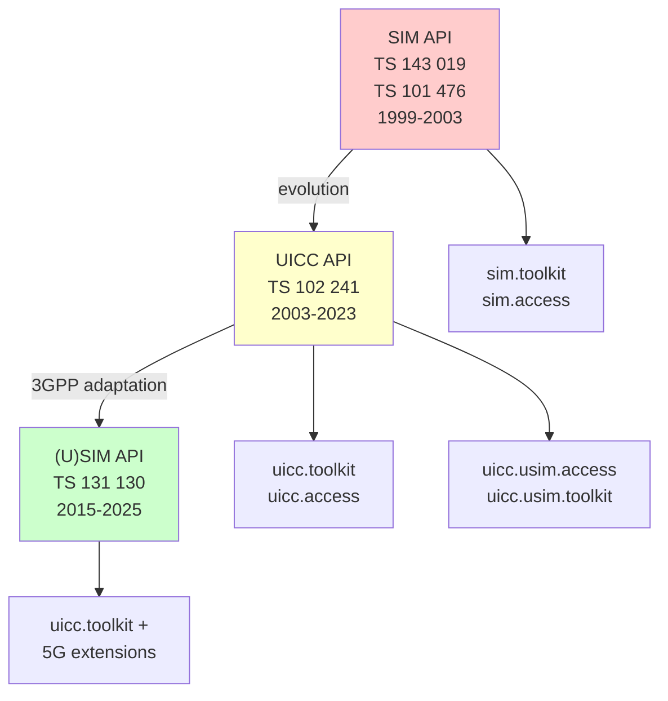
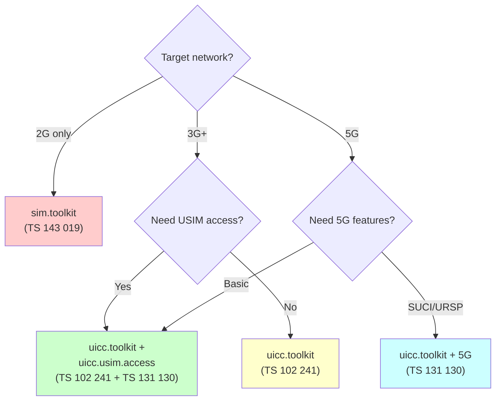

# Эволюция UICC API: sim.toolkit → uicc.toolkit → 5G

> **Synthesis** — эволюция программного интерфейса UICC для Java Card: от первых SIM API до современных 5G API.

---

## 1. Три эпохи UICC API

```
Эпоха I: SIM API              Эпоха II: UICC API           Эпоха III: (U)SIM API
═══════════════════════       ════════════════════════     ═══════════════════════
1999-2003                     2003-2015                    2015-настоящее

GSM 2G only                   UMTS + LTE                   5G
TS 143 019 (3GPP)             TS 102 241 (ETSI)            TS 131 130 (3GPP)
TS 101 476 (ETSI)             sim.toolkit (legacy)         uicc.toolkit + usim
sim.toolkit                   uicc.toolkit (new)           5G NAS context
sim.access                    uicc.access                  SUCI API
                              uicc.usim.access (NEW!)      eUICC API
```

---

## 2. Семейство API-спецификаций



---

## 3. Сравнение пакетов по эпохам

| Пакет | Эпоха I (SIM) | Эпоха II (UICC) | Эпоха III (5G) |
|---|---|---|---|
| **Toolkit** | `sim.toolkit` | `uicc.toolkit` | `uicc.toolkit` |
| **File Access** | `sim.access` | `uicc.access` | `uicc.access` |
| **USIM Access** | ❌ | `uicc.usim.access` | `uicc.usim.access` |
| **USIM Toolkit** | ❌ | `uicc.usim.toolkit` | `uicc.usim.toolkit` |
| **System** | ❌ | `uicc.system` | `uicc.system` |
| **Security** | ❌ | `uicc.security` | `uicc.security` |

### AID пакетов

| Пакет | AID | Эпоха |
|---|---|---|
| `sim.toolkit` | `A0 00 00 00 76 01 01` | I |
| `uicc.toolkit` | `A0 00 00 00 09 00 05` | II |
| `uicc.access` | `A0 00 00 00 09 00 05` | II |
| `uicc.usim.access` | `A0 00 00 00 87 10 05` | III |

---

## 4. API по спецификации

### TS 143 019 (SIM API, 1999-2003)

Первая спецификация, определившая Java API для SIM-карт.

```java
package sim.toolkit;

public interface ToolkitInterface {
    void processToolkit(APDU apdu);
}

public class ProactiveHandler {
    public static ProactiveHandler getTheHandler();
    public void init(short command, byte qualifier, byte deviceId);
    public void appendTLV(byte tag, byte[] value, short offset, short length);
    public void send() throws ToolkitException;
}

public class ToolkitRegistry {
    public static ToolkitRegistry getEntry();
    public byte initMenuEntry(byte[] text, short offset, short length,
                              byte position, boolean help,
                              byte iconId, byte iconQualifier);
    public void setEvent(byte event);
}
```

Ограничения:
- **Только канал 0** (один логический канал)
- **Только GSM** (CLA=A0)
- **Только DF_GSM** (7F20)
- **Нет multi-verification**
- **Нет SEID** (Security Environment)
- Нет eCAT, нет contactless, нет BIP расширений

### TS 102 241 (UICC API, 2003-2023)

Расширение API до уровня UICC:

```java
package uicc.toolkit;

// Все те же классы что в sim.toolkit, плюс:
public class ProactiveHandler {
    // + поддержка каналов 0-19
    // + eCAT
    // + SEID-aware команды
    public void init(short command, byte qualifier, byte deviceId, byte seid);
}

public class ToolkitRegistry {
    // + eCAT регистрация
    // + SEID-aware меню
    // + Contactless события (HCI)
    public void setEvent(byte event, byte seid);
}

// Новые пакеты:
package uicc.access;         // Базовый доступ к UICC ФС
package uicc.usim.access;    // Доступ к ADF.USIM файлам
```

Нововведения:
- ✅ Логические каналы 0-19
- ✅ Multi-verification (Universal PIN, SEID)
- ✅ eCAT (extended CAT) — удалённое управление
- ✅ Contactless events (HCI Connector)
- ✅ Расширенные BIP каналы
- ✅ `uicc.usim.access` — прямой доступ к USIM-файлам

### TS 131 130 ((U)SIM API, 2015-2025)

3GPP-специфичный слой поверх TS 102 241:

```java
package uicc.usim.access;

// Специфичные классы для доступа к USIM:
public interface USIMFileView extends FileView {
    // Прямой доступ к ADF.USIM EF
    byte[] readIMSI();
    byte[] readMSISDN();
    byte[] readSPN();
    // ... сотни методов для конкретных EF
}

// 5G extensions:
public interface FiveGAccess {
    byte[] getSUCI();
    byte[] get5GAuthKeys();
    byte[] getURSP();  // UE Route Selection Policy
}
```

Нововведения Release 15-18:
- ✅ 5G NAS Security Context (EF_5GS3GPPNSC)
- ✅ SUCI calculation (Subscription Concealed Identifier)
- ✅ URSP (UE Route Selection Policy — 5G slicing)
- ✅ eUICC API (для eSIM профилей)
- ✅ LSI Command (Logical Secure Element Interface)
- ✅ Envelope Container
- ✅ 3GPP PS Data Off

---

## 5. Эволюция ключевых классов

### ProactiveHandler.init()

```
SIM API:   init(cmd, qual, devId)
UICC API:  init(cmd, qual, devId)
           init(cmd, qual, devId, seid)     ← NEW
5G API:    init(cmd, qual, devId)
           init(cmd, qual, devId, seid)
           init(cmd, qual, devId, seid, lsi) ← NEW (TS 131 130)
```

### ToolkitRegistry.setEvent()

```
SIM API:   setEvent(event)
UICC API:  setEvent(event)
           setEvent(event, seid)            ← NEW
5G API:    setEvent(event)
           setEvent(event, seid)
           + новые события: HCI, Access Tech Change
```

---

## 6. Когда какая спецификация применима

| Ситуация | Спецификация | Пакет |
|---|---|---|
| GSM SIM (2G only) | TS 143 019 | `sim.toolkit` |
| UMTS/WCDMA (3G) | TS 102 241 | `uicc.toolkit` |
| LTE (4G) | TS 102 241 + TS 131 130 | `uicc.toolkit` + usim |
| 5G NR | TS 131 130 | `uicc.toolkit` + 5G ext |
| eUICC / eSIM | TS 102 241 + TS 131 130 + GSMA | `uicc.toolkit` + eUICC API |
| IoT / NB-IoT | TS 131 130 | `uicc.toolkit` |

---

## 7. Сравнение Install Parameters

| Параметр | SIM API (CA) | UICC API (CA/TA) | 5G API (CA/TA/EA) |
|---|---|---|---|
| **Access Domain** | 1 байт | 1 байт | 1 байт |
| **Priority** | 1 байт | 1 байт | 1 байт |
| **Max Timers** | 1 байт | 1 байт | 1 байт |
| **Max Menu Text** | 1 байт | 2 байта | 2 байта |
| **Max Menu Entries** | 1 байт | 1 байт | 1 байт |
| **TAR values** | 3 байта | 3×N байт | 3×N байт |
| **SEID support** | ❌ | ✅ | ✅ |
| **eCAT parameters** | ❌ | `EA` tag | `EA` tag |
| **LSI parameters** | ❌ | ❌ | `EA` tag |

---

## 8. Рекомендации по выбору API



> [!tip] Практический совет
> Если сомневаетесь — используйте `uicc.toolkit` (TS 102 241). Это покрывает 95% случаев для 3G/4G/5G. `sim.toolkit` нужен только если вы точно знаете что работаете с legacy GSM SIM.

## Ссылки на источники

- SIM API: [[wiki/summaries/ts_143019|TS 143 019]]
- UICC API: [[wiki/summaries/ts_102241|TS 102 241]]
- (U)SIM API: [[wiki/summaries/ts_131130|TS 131 130]]
- SIM Toolkit API: [[wiki/summaries/ts_101476|TS 101 476]]
- STK Applet: [[wiki/concepts/STK_Applet]]
- Миграция guide: [[wiki/syntheses/sim_vs_uicc_toolkit|sim vs uicc toolkit]]
